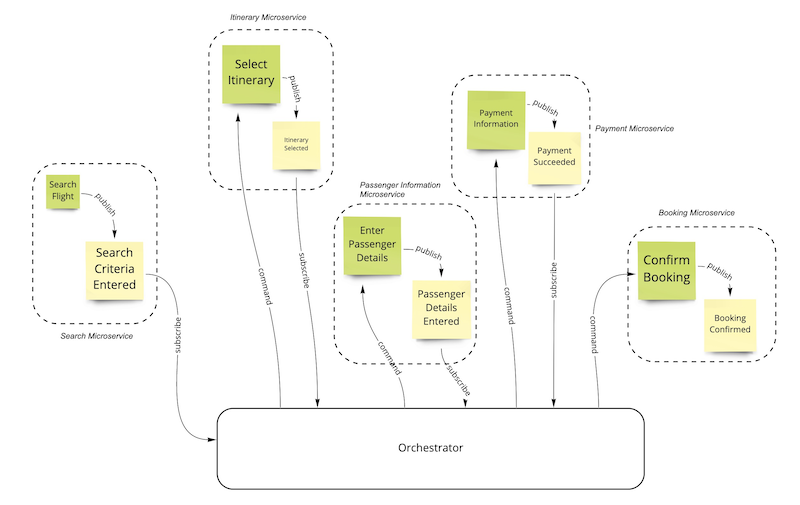
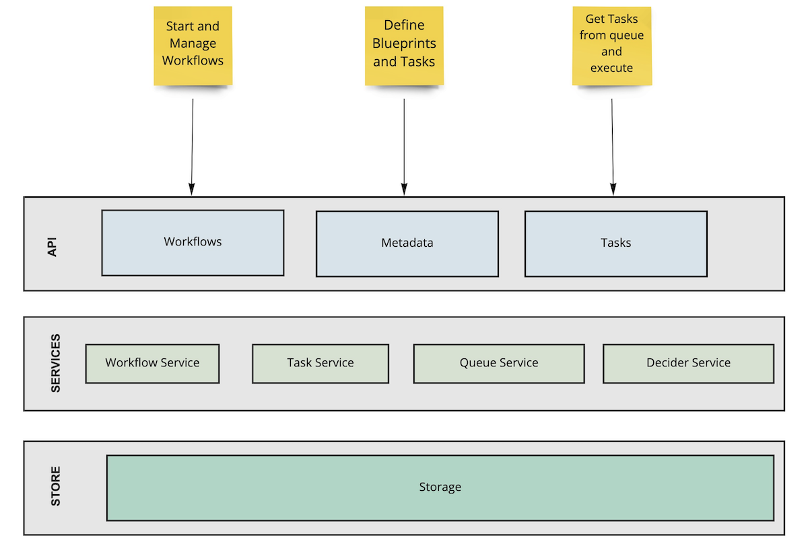

Microservices have emerged as the dominant application development paradigm in the software world today. It has
tremendous benefits both from a business and technical perspective due to its fundamental characteristics of agility,
scalability, and resiliency.

However, implementing microservices are hard! The inherently distributed nature of this architectural pattern introduces
complexity across multiple areas especially around Transaction Management, Data Consistency, and Process Automation. In
a distributed system, Business Transactions can span across multiple services. Since we no longer have the ability to
run a single ACID transaction, it requires careful coordination across these services to ensure that you have a
consistent and reliable system at the end of a business process.

Solutions to solve this “coordination” problem have led to the rise of a new set of application patterns that can be
broadly classified into two main groups - Choreography and Orchestration.

<!--truncate-->

Let us tackle the first group - choreography which advocates the usage of events as a coordination mechanism to complete
local tasks within each microservice involved in an end-to-end business transaction. Each microservice is responsible
for its local execution of the transaction resulting in the publishing of events that other microservices react to and
then execute their local transactions. In other words, a sequence of event subscriptions across various microservices to
complete a business transaction.

Using the ubiquitous “Flight Booking example to depict a choreographic approach.

 
_Choreogrpahy_

As seen the various microservices utilize events to interact with each other to complete the booking process flow.

The tendency to move towards choreography to implement business flows in a distributed environment is natural, the major
appeal being the autonomy that this pattern provides. As seen in the flight booking example below, each microservice
executes its local transaction and publishes events that are subscribed to by other microservices which in turn trigger
local transactions.

But as you start looking at it more closely, we realize that there is a relationship or a logical flow between the
subscriptions and that is where it starts to become problematic.

- To begin with, it becomes difficult to see the flow as it is embedded within code. In other words, the lack of
  visibility into the process flows is a challenging aspect of choreography as you would need to reason over all the
  various microservices to infer the flow.
- It becomes extremely difficult to gauge the impact of a change within the flow
  requiring coordinated deployment and hope that it works due to the inability to test it holistically (since each service
  just does its own bit).
- There is no systematic mechanism to report as well as action on technical/business metrics
  associated with the process (e.g. SLAs, How much are we done with Process X ?).

In short, with peer-to-peer choreography, it becomes harder to scale with growing business needs and complexities. It
does offer a low entry barrier but you completely lose sight of the larger-scale flow.

On the other side of the spectrum is the Orchestration approach which relies purely on a task-based approach to
coordinate and execute process flows. Generally, it is implemented using a central component that issues task-based
requests to the individual services, interprets response(s), and decides to proceed/terminate or complete the flow.

Going back to the Flight Booking problem, if the orchestration approach is adopted, it would be depicted like something
below.

 
_Orchestration_

The orchestration approach does alleviate some of the problems that choreography poses - There is now complete process
visibility and traceability into the process flows, change impact is localized to the central component and it generally
becomes easier and quicker to debug issues as well as action on them.

However applying orchestration is easier said than done and while at first glance it looks easy, it does have a whole
set of challenges associated with its implementation.

- For example, how do we prevent the centralized component from being a single point of failure?
- In addition to that, we would need to ensure that there are no business logic creeps into the component and it does what it is intended to do
  i.e. just pure orchestration.
- And finally, how do we provide reliable, resilient, and scalable orchestration services
  since it forms such a critical piece of the infrastructure.

In short, we would need to build a distributed orchestration engine. And building one is not easy! Like any other piece
of infrastructural software, it is always prudent to utilize a purpose-built tool. And it holds true in the case of a
distributed orchestration engine too.

Introducing Conductor which was built to help orchestrate microservices based process flows at Netflix.

- Conductor provides a clean task-based API backed by a distributed server ecosystem to create a highly efficient and
  scalable distributed orchestration engine.
- It uses a well-structured DSL mechanism to help define process flows across microservices.
- It provides full operational control over process flows including operations for pause/resume/retry and a
  user interface to visualize, replay and search the flows.
- Not to mention the fact that it is battle-tested for scale at Netflix volumes running millions of concurrent process flows.

 
_Netflix Conductor Architecture_

To conclude, the choice of orchestration over choreography to help run your process flows across microservices is a safe
one. However, it would be advisable to use a purpose-built engine like Netflix Conductor to help implement your
orchestration needs. The implementation is complex especially in a distributed system and Conductor helps abstract all
the technical and infrastructural complexities associated with orchestration helping you focus on your business code.

The adoption and usage of Conductor have exploded over the past few years since it was first released. Organizations
rely on Conductor to help implement reliable, scalable, and resilient Microservices-based applications utilizing a
robust distributed orchestration engine. From powering complex loan origination processes at a leading Financial
Institution to enabling India’s largest food delivery platform to assist sales at a large real estate brokerage company,
the range of use cases that Conductor supports is broad.

And that is precisely why we started Orkes! Orkes brings to market an enterprise-grade, cloud-hosted, fully managed
version of Netflix Conductor offering full compatibility with the open-source version along with tiered support.

Early access to the platform is now available for interested
customers [https://orkes.io](https://orkes.io "Microservices and Workflow Orchestration at scale")

<iframe src="https://ghbtns.com/github-btn.html?user=netflix&repo=conductor&type=watch&count=true&size=large" frameborder="0" scrolling="0" width="170" height="30" title="GitHub"></iframe>
<iframe src="https://ghbtns.com/github-btn.html?user=netflix&repo=conductor&type=star&count=true&size=large" frameborder="0" scrolling="0" width="170" height="30" title="GitHub"></iframe>

[Netflix Conductor Open Source Github Repo](https://github.com/Netflix/conductor)

[Learn more about Orkes](https://orkes.io "Microservices and Workflow Orchestration at scale")

[Join the Orkes Conductor Slack community here](https://join.slack.com/t/orkes-conductor/shared_invite/zt-xyxqyseb-YZ3hwwAgHJH97bsrYRnSZg "Join the Conductor Slack Community")

[Want to work at Orkes?](https://jobs.lever.co/Orkes/ "Apply to Jobs at Orkes")
