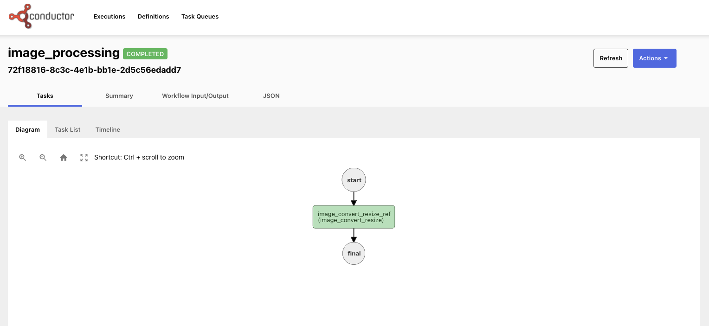
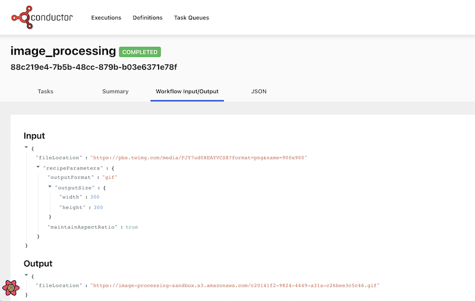

There are many tools available to work with images - resizing, changing the format, cropping, changing colors, etc.  Tools like Photoshop require a lot of manual work to create image.  Online tools for image processing are also extremely popular. But, rather than doing the work manually, or paying for a service to modify your images, wouldn't it be cool to have a workflow that does image resizing for you automatically?  In this post, we'll build just this using Conductor to orchestrate the microservices involved, and to create an API-like surface for image processing.

In this post, we'll run Conductor locally on your computer. The Conductor workflow consists of two tasks.  The first task reads in an image and resizes it according to the parameters provided (labeled "image_convert_resize_ref" in the image below).  The second task ("image_toS3_ref" below) takes the resized image and saves the it to an Amazon S3 bucket.


Using a microservice architecture for this process allows for easy swapping of components, and allows for easy extension of the workflow - easily adding additional image processing steps (or even swapping in and out different processes for different workflows). We could also easily change the location of the saved file based on different parameters. 
<!--truncate -->

## Getting started

To run our microservice, we're going to run the entire process locally on your computer. Let's get the prerequisites out of the way first.

### Installing ImageMagick

In order to resize the image, our Java app will be using Imagemagick - so we need to make sure that it is [installed on your machine](https://imagemagick.org/script/download.php).

Using a Mac, you can use Homebrew: ```brew install imagemagick```

### Installing Conductor locally

To run Conductor, you'll need:
* Java JDK 11 or higher.
* [NPM](https://nodejs.org/en/download/package-manager/)
* [Yarn](https://classic.yarnpkg.com/en/docs/install) 

Next, we'll clone [Conductor from GitHub](https://github.com/Netflix/conductor)

```
git clone https://github.com/Netflix/conductor.git
```

Now we can build and run the Conductor server:

```
cd conductor
$ cd server
$ ../gradlew bootRun
```

You can now visit ```http://localhost:8080``` to see your Conductor server.  The Swagger API docs on this site can be used for all of the API calls.


In another terminal, let's get the Conductor UI up and running:

```
cd conductor/ui
ui $ yarn install
ui $ yarn run start
```

The UI is now accessible at ```http://localhost:5000```

### AWS Bucket setup

You'll need an AWS account, and the [AWS command line interface](https://aws.amazon.com/cli/)  installed.  Set up a S3 bucket to host the images, and then create a IAM worker that has access to write to the bucket.  For the example here, we created a user called “orkes-workers” that has permissions to list read & write into our S3 bucket.


Under the “security credentials” tab, we added an Access Key ID (and the related Secret Access key). Add these credentials to your CLI as follows:

```
$ aws configure --profile orkes-workers
AWS Access Key ID [None]: <your Access key>
AWS Secret Access Key [None]: <your secret key>
Default region name [None]: <your choice, I used us-east-1>
Default output format [None]: <json>
```

Now, you have a local AWS configuration to save the processed image to your S3 bucket.

## Building your Conductor workflow

Every Conductor workflow consists of a series of tasks that will be run. If you are following along with the code, you can clone the orkesworkers repository from GitHub:

```
https://github.com/orkes-io/orkesworkers
```

### Tasks

#### Resizing the image 
The first task takes an image input along with modification instructions. This task will save the image locally.

Here's the path to the task in GitHub: ``` /data/task/image_convert_resize.json```:

```
{
 "name": "image_convert_resize",
 "retryCount": 3,
 "timeoutSeconds": 30,
 "pollTimeoutSeconds": 30,
 "inputKeys": [
   "fileLocation",
   "outputFormat",
   "outputWidth",
   "outputHeight"
 ],
 "outputKeys": [
   "fileLocation"
 ],
 "timeoutPolicy": "TIME_OUT_WF",
 "retryLogic": "FIXED",
 "retryDelaySeconds": 60,
 "responseTimeoutSeconds": 60,
 "concurrentExecLimit": 100,
 "rateLimitFrequencyInSeconds": 60,
 "rateLimitPerFrequency": 50,
 "ownerEmail": "devrel@orkes.io"
}
```

The task has a timeout of 30s, and will retry 3x after 60s on a failure.  This task expects 5 values: a file and 4 parameters for optimization: the output format, width, height and whether the aspect ratio should be maintained (if this is set to false, we can stretch or squash the image in strange ways.).

To add this to our local conductor instance, we can use the Swagger UI found at localhost:8080, or you can use CURL (note that this endpoint expects a JSON list):

```
curl -X 'POST' \
  'http://localhost:8080/api/metadata/taskdefs' \
  -H 'accept: */*' \
  -H 'Content-Type: application/json' \
  -d '[
{"name":"image_convert_resize","retryCount":3,"timeoutSeconds":30,"pollTimeoutSeconds":30,"inputKeys":["fileLocation","outputFormat","outputWidth","outputHeight"],"outputKeys":["fileLocation"],"timeoutPolicy":"TIME_OUT_WF","retryLogic":"FIXED","retryDelaySeconds":60,"responseTimeoutSeconds":60,"concurrentExecLimit":100,"rateLimitFrequencyInSeconds":60,"rateLimitPerFrequency":50,"ownerEmail":"devrel@orkes.io"}
     ]'
```

#### Saving the image to S3

The second task will begin on the completion of the first task - its input is the saved location of the image from the first task.  The image is read into memory, and then the sent to the S3 bucket.  The output of this task is the URL on S3:

```
{
"name": "upload_toS3_ref",
"retryCount": 3,"timeoutSeconds": 30,
"pollTimeoutSeconds": 30,
"inputKeys": [
  "fileLocation"
],
"outputKeys": [
  "s3Url"
],
"timeoutPolicy": "TIME_OUT_WF",
"retryLogic": "FIXED",
"retryDelaySeconds": 30,
"responseTimeoutSeconds": 30,
"concurrentExecLimit": 100,
"rateLimitFrequencyInSeconds": 30,
"rateLimitPerFrequency": 50,
"ownerEmail": "devrel@orkes.io"
}
```

We'll use all the same retry and timeout values as the first task.


### Workflow

The workflow is the wrapper around our tasks, telling Conductor the tasks, and the order in which they should be run.

```
{
 "name": "image_convert_resize",
 "description": "Image Processing Workflow",
 "version": 1,
 "tasks": [
   {
     "name": "image_convert_resize",
     "taskReferenceName": "image_convert_resize_ref",
     "inputParameters": {
       "fileLocation": "${workflow.input.fileLocation}",
       "outputFormat": "${workflow.input.recipeParameters.outputFormat}",
       "outputWidth": "${workflow.input.recipeParameters.outputSize.width}",
       "outputHeight": "${workflow.input.recipeParameters.outputSize.height}"
     },
     "type": "SIMPLE",
     "decisionCases": {},
     "defaultCase": [],
     "forkTasks": [],
     "startDelay": 0,
     "joinOn": [],
     "optional": false,
     "defaultExclusiveJoinTask": [],
     "asyncComplete": false,
     "loopOver": []
   },
    {
      "name": "upload_toS3_ref",
      "taskReferenceName": "upload_toS3_ref",
      "inputParameters": {
        "fileLocation": "${image_convert_resize_ref.output.fileLocation}"
      },
      "type": "SIMPLE",
      "decisionCases": {},
      "defaultCase": [],
      "forkTasks": [],
      "startDelay": 0,
      "joinOn": [],
      "optional": false,
      "defaultExclusiveJoinTask": [],
      "asyncComplete": false,
      "loopOver": []
    }
 ],
 "outputParameters": {
   "fileLocation": "${upload_toS3_ref.output.fileLocation}"
 },
 "schemaVersion": 2,
 "restartable": true,
 "workflowStatusListenerEnabled": true,
 "ownerEmail": "devrel@orkes.io",
 "timeoutPolicy": "ALERT_ONLY",
 "timeoutSeconds": 0,
 "variables": {},
 "inputTemplate": {}
}
```

In the workflow, you can see that 2 tasks are defined.  In the workflow definition, we defined the input parameters.  

### Input for the first task

The first task reads in the image URL and three modification parameters. These are supplied from the workflow input (note that the first two parameters are ```workflow.input```).

### Input for the second task

The second task takes location of the modified image on the local machine to upload to S3.  The location of the image on the device comes from the output of the first task (```image_convert_resize_ref.output.fileLocation```),

### Submitting our workflow to Conductor

Submitting this workflow to Conductor via CURL looks like this (Note that this endpoint expects just JSON, not a list):

```
curl -X 'POST' \
  'http://localhost:8080/api/metadata/workflow' \
  -H 'accept: */*' \
  -H 'Content-Type: application/json' \
  -d ' {"name":"image_convert_resize","description":"Image Processing Workflow","version":1,"tasks":[{"name":"image_convert_resize","taskReferenceName":"image_convert_resize_ref","inputParameters":{"fileLocation":"${workflow.input.fileLocation}","outputFormat":"${workflow.input.recipeParameters.outputFormat}","outputWidth":"${workflow.input.recipeParameters.outputSize.width}","outputHeight":"${workflow.input.recipeParameters.outputSize.height}"},"type":"SIMPLE","decisionCases":{},"defaultCase":[],"forkTasks":[],"startDelay":0,"joinOn":[],"optional":false,"defaultExclusiveJoinTask":[],"asyncComplete":false,"loopOver":[]},{"name":"image_toS3","taskReferenceName":"image_toS3_ref","inputParameters":{"fileLocation":"${image_convert_resize_ref.output.fileLocation}"},"type":"SIMPLE","decisionCases":{},"defaultCase":[],"forkTasks":[],"startDelay":0,"joinOn":[],"optional":false,"defaultExclusiveJoinTask":[],"asyncComplete":false,"loopOver":[]}],"outputParameters":{"fileLocation":"${image_toS3_ref.output.fileLocation}"},"schemaVersion":2,"restartable":true,"workflowStatusListenerEnabled":true,"ownerEmail":"devrel@orkes.io","timeoutPolicy":"ALERT_ONLY","timeoutSeconds":0,"variables":{},"inputTemplate":{}}'

```


With just 3 API calls (defining 2 tasks and the workflow), our orchestration is all set to run. Now we need to run the Java apps that will do the resizing.  

## The Java Workers

Our Java apps are in the [orkesworkers](https://github.com/orkes-io/orkesworkers) GitHub repository, and can be started by running the OrkesWorkersApplication.java.  

The OrkesWorkersApplication creates a list all of the workers that are available in the repository, and reports those to the conductor.server.url (defined in ```resources/application.properties``` as ```http://localhost:8080/api```).

This will poll the Conductor server for any tasks for any of the workers that are running locally.  When a task appears, Conductor will send it to the worker.  

When a image_processing API call to Conductor is made - Conductor will identify the data as belonging to the first task, and send the image (and modification data) to ```ImageConvertResize.java```.  

### Resizing the image

ImageConvertResize.java reads in the image, and the new parameters, and then use imageMagick to resize the image and save it locally.  The saved file location is returned to Conductor.

The workflow shows that the output from image resizing is the input for the upload to S3 worker.

### Upload to S3

The Upload to S3 worker takes the location of the local file (note that since the file is saved locally, these 2 services must run on the same instance), and sends it to the AWS bucket.  The worker then returns the URL of the image hosted at AWS.  

Conductor outputs this URL as the output of the overall workflow.

## Testing our orchestration

Our Orchestration is ready to go, and with a simple API call, we can kick it off.  To test this, we'll use a photo of TikTok's favourite trainspotter, Francis Bourgeois (image grabbed from Twitter):


This image is a png, and is 900x900 pixels.  We'll use the API to create a gif that is 300x300.  The JSON we submit must follow the formatting of the Workflow input parameters (after ```workflow.input.```), and so must have the following format:

```
{
	"fileLocation": "https://pbs.twimg.com/media/FJY7ud0XEAYVCS8?format=png&name=900x900",
	"recipeParameters": {
		"outputFormat": "gif",
		"outputSize": {
			"width": 300,
			"height": 300
		}
	}
}
```
Our workflow is listening at ```http://localhost:8080/api/workflow/image_processing``` for the input. So, we can send a curl command:

```
curl -X 'POST' \
  'http://localhost:8080/api/workflow/image_convert_resize?priority=0' \
  -H 'accept: text/plain' \
  -H 'Content-Type: application/json' \
  -d '{"fileLocation": "https://pbs.twimg.com/media/FJY7ud0XEAYVCS8?format=png&name=900x900",
        "recipeParameters": {
          "outputFormat": "gif",
          "outputSize": {
            "width": 300,
            "height": 300
           }
        }
      }'
```

The response will be a Workflow ID. If you have ElasticSearch running on your system, the results will appear at localhost:5000.  If you do not (and it was not a part of this tutorial) - you can browse to the workflow manually by visiting ```http://localhost:5000/execution/[workflowid]```


You'll see a page similar to the one below with “completed” in green next to the workflowId:




If you click on the Workflow input/output tab, you'll see the output.fileLocation:



Here's an example PNG file created by the workflow:


Imagemagick supports creating webp, jpg, png, gif, and many more (avif works!). Looking closely at the output above, you can see that in this workflow the image was converted to a 300x300 GIF image.  


## Conclusion

This very simple Conductor workflow takes an image input, runs a Java task to resize the image and save it in an AWS S3 bucket, and outputs the url.  Give it a try yourself, and join the [Orkes-Conductor](https://join.slack.com/t/orkes-conductor/shared_invite/zt-xyxqyseb-YZ3hwwAgHJH97bsrYRnSZg) community on Slack!
