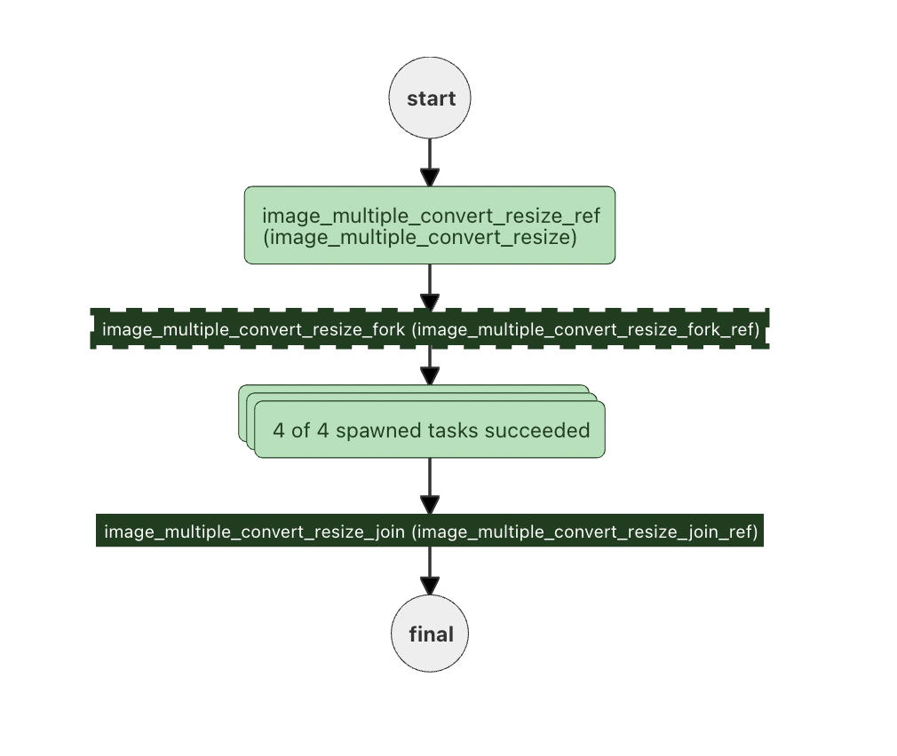

In recent posts, we have built several image processing workflows with Conductor. In our first post, we created an [image processing workflow for one image](/content/blog/image-processing-workflow-with-conductor) - where we provide an image along with the desired output dimensions and format. The workflow output is a link on Amazon S3 to the desired file.

In the 2nd example, we used the FORK System task to create [multiple images](/content/blog/image-processing-multiple-images-forks) in parallel. The number of images was hardcoded in the workflow - as FORK generates exactly as many paths as are coded into the workflow.

Several images are hardcoded in the workflow, but only 2 images are created. When it comes to image generation, there is often a need for more images (as new formats become popular) or sizes - as more screens are supported.

Luckily, Conductor supports this flexibility and has a feature to specify the number of tasks to be created at runtime. In this post, we'll demonstrate the use of [dynamic forks](/content/docs/reference-docs/dynamic-fork-task), where the workflow splitting is done at runtime.

Learn how to create a dynamic fork workflow in this post!



<!-- truncate -->

## Workflows with Dynamic forks

In our use case, the number of parallel processes will be determined at runtime, so we'll use the [FORK_JOIN_DYNAMIC](https://orkes.io/content/docs/reference-docs/dynamic-fork-task) to create the parallel tasks on the spot. When the tasks are completed, the workflow will join back and continue.

Here's the workflow (you can also find it on [GitHub](https://github.com/orkes-io/orkesworkers/blob/main/data/workflow/image_multiple_convert_resize.json)):

```
{
  "name": "image_multiple_convert_resize",
  "description": "Convert an image to multiple formats and sizes",
  "version": 1,
  "tasks": [
    {
      "name": "image_multiple_convert_resize",
      "taskReferenceName": "image_multiple_convert_resize_ref",
      "inputParameters": {
        "fileLocation": "${workflow.input.fileLocation}",
        "outputFormats": "${workflow.input.outputFormats}",
        "outputSizes": "${workflow.input.outputSizes}",
        "maintainAspectRatio": "${workflow.input.maintainAspectRatio}"
      },
      "type": "SIMPLE",
      "decisionCases": {},
      "defaultCase": [],
      "forkTasks": [],
      "startDelay": 0,
      "joinOn": [],
      "optional": false,
      "defaultExclusiveJoinTask": [],
      "asyncComplete": false,
      "loopOver": []
    },
    {
      "name": "image_multiple_convert_resize_fork",
      "taskReferenceName": "image_multiple_convert_resize_fork_ref",
      "inputParameters": {
      "dynamicTasks": "${image_multiple_convert_resize_ref.output.dynamicTasks}",
      "dynamicTasksInput": "${image_multiple_convert_resize_ref.output.dynamicTasksInput}"
      },
    "type": "FORK_JOIN_DYNAMIC",
    "dynamicForkTasksParam": "dynamicTasks",
    "dynamicForkTasksInputParamName": "dynamicTasksInput"
    },
    {
      "name": "image_multiple_convert_resize_join",
      "taskReferenceName": "image_multiple_convert_resize_join_ref",
      "type": "JOIN"
    }
  ],
  "outputParameters": {
    "fileLocations": "${image_convert_resize_ref.output.fileLocation}"
  },
  "schemaVersion": 2,
  "restartable": true,
  "workflowStatusListenerEnabled": true,
  "ownerEmail": "devrel@orkes.io",
  "timeoutPolicy": "ALERT_ONLY",
  "timeoutSeconds": 0,
  "variables": {},
  "inputTemplate": {}
}
```

### Task definition

As the diagram and JSON above show, we will have 3 tasks:

- `image_multiple_convert_resize_ref` - This task will read the input and define the dynamic tasks based on the inputs. It will then send the list of dynamic tasks to the fork:
- `image_multiple_convert_resize_fork` - The dynamic fork will take the list of dynamic tasks required and create the task.
- `image_convert_resize_<varied>` - This task will run once inside each dynamic task, and the variable at the end will correspond to a specific image being created.

Let's look at each task in detail:

### Multiple convert resize task

This task reads in all the parameters (the image location and the output formats and sizes) and outputs dynamic tasks and the inputs for each dynamic task.

```
{

  "name": "image_multiple_convert_resize",
  "retryCount": 3,
  "timeoutSeconds": 30,
  "pollTimeoutSeconds": 30,
  "inputKeys": [
    "fileLocation",
    "outputFormats",
    "outputSizes"
  ],
  "outputKeys": [
    "dynamicTasks",
    "dynamicTasksInput"
  ],
  "timeoutPolicy": "TIME_OUT_WF",
  "retryLogic": "FIXED",
  "retryDelaySeconds": 15,
  "responseTimeoutSeconds": 30,
  "concurrentExecLimit": 100,
  "rateLimitFrequencyInSeconds": 60,
  "rateLimitPerFrequency": 50,
  "ownerEmail": "devrel@orkes.io"
}

```

The Java app listening for this task creates the dynamicTasks and dynamicTasksInput:

```
List<WorkflowTask> dynamicTasks =  Lists.newArrayList();
Map<String, Object> dynamicTasksInput = Maps.newHashMap();

int i=0;
String dynamicTaskName = "image_convert_resize";
for (String outputFormat :
        outputFormats) {
    for (Size size:
         outputSizes) {
        String taskRefName = String.format("%s_%s_%sx%s_%d",dynamicTaskName, outputFormat, size.width, size.height, i++);
        WorkflowTask dynamicTask = new WorkflowTask();
        dynamicTask.setName(dynamicTaskName);
        dynamicTask.setTaskReferenceName(taskRefName);
        dynamicTasks.add(dynamicTask);

        Map<String, Object> dynamicTaskInput = Maps.newHashMap();
        dynamicTaskInput.put("fileLocation", fileLocation);
        dynamicTaskInput.put("outputFormat", outputFormat);
        dynamicTaskInput.put("outputWidth", size.width);
        dynamicTaskInput.put("outputHeight", size.height);
        dynamicTaskInput.put("maintainAspectRatio", maintainAspectRatio);

        dynamicTasksInput.put(taskRefName,dynamicTaskInput );
    }
}

```

### Resize dynamic fork

The Dynamic fork reads in all the `dynamicTasks` and `dynamicTasksInput` from the first task and spawns out all the tasks to be run.

### image_convert_resize

The image conversion task does not actually appear in the workflow. It is called in the Java application as the dynamicTaskName:

`String dynamicTaskName = "image_convert_resize";`

Each of the tasks is given a unique reference at the end, appending the format, height, width and a counter to each task:

`String taskRefName = String.format("%s_%s_%sx%s_%d",dynamicTaskName, outputFormat, size.width, size.height, i++);`

This task is also present in the [GitHub repository](https://github.com/orkes-io/orkesworkers/blob/main/data/task/image_convert_resize.json).

## Creating the workflow in Conductor

We will need to create 2 tasks (and for simplicity, we can just copy the files from GitHub): `image_multiple_convert_resize.json` and `image_convert_resize.json`.

You can add these definitions using curl:

```
curl -X 'POST' \
  'http://localhost:8080/api/metadata/taskdefs' \
  -H 'accept: */*' \
  -H 'Content-Type: application/json' \
  -d '[
<JSON HERE>
     ]'
```

Next, we'll create the workflow - again, copying the JSON from GitHub, and using curl:

```
curl -X 'POST' \
  'http://localhost:8080/api/metadata/workflow' \
  -H 'accept: */*' \
  -H 'Content-Type: application/json' \
  -d ' <JSON here>'
```

## Running our workflow

Now that the workflow is defined, we are ready to run it. Let's create 3 different formats, each with 3 different-sized images:

```
{
	"fileLocation": "https://pbs.twimg.com/media/FJY7ud0XEAYVCS8?format=png&name=900x900",
	"outputFormats": ["png","jpg","webp"],
	"outputSizes": [
		{"width":300,
		"height":300},
		{"width":200,
		"height":200},
        {"width":1200,
		"height":1200}
	]
}
```

```
curl -X 'POST' \
  'http://localhost:8080/api/workflow/image_multiple_convert_resize?priority=0' \
  -H 'accept: text/plain' \
  -H 'Content-Type: application/json' \
  -d '<json>'
```

This will spawn 9 different processes and create 9 images.

### Not quite the same

In this workflow, our dynamic task creates the resized and reformatted images. In the earlier workflows, there is a second task that uploads the videos to S3. A Dynamic task will only run one task, so in this case, we are just generating the image.

To run several tasks per dynamic task, we'll need to create a [subworkflow](https://orkes.io/content/docs/reference-docs/sub-workflow-task) inside the dynamic task.

For simplicity, we've introduced the dynamic task here, and in our next post, we will combine the dynamic task with a subworkflow to create the images AND upload them to S3.
