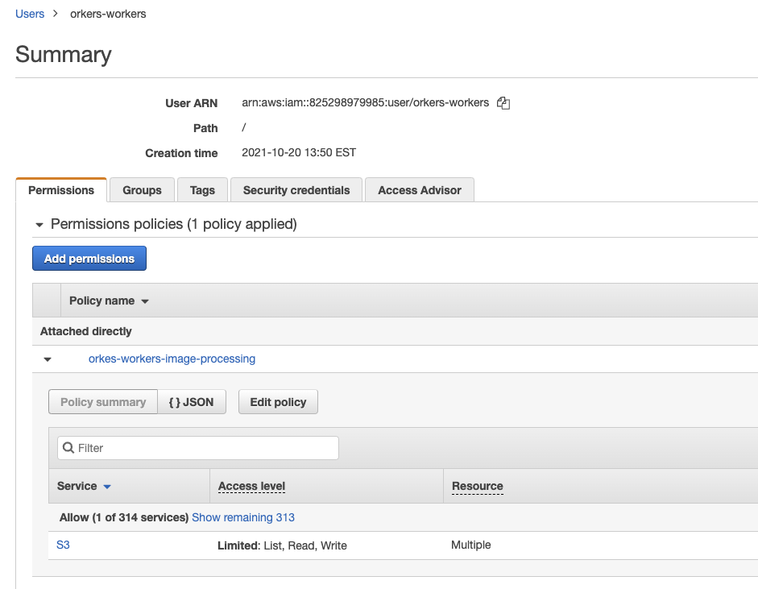
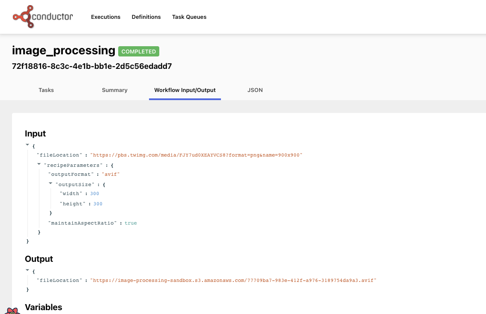

There are many tools available to work with images - resizing, changing the format, cropping, changing colors, etc.  Tools like Photoshop require a lot of manual work to create image.  Online tools for image processing are also extremely popular. But, rather than doing the work manually, or paying for a service to modify your images, wouldn't it be cool to have a workflow that does image resizing for you automatically?  In this post, we'll build just this using Conductor to orchestrate the microservices involved, and to create an API-like surface for image processing.

In this post, we'll run Conductor locally on your computer. The Conductor workflow consists of one task.  This task reads in an image, resizes it according to the parameters provided, and then saves the modified image to an Amazon S3 bucket.
<!--truncate -->

## Getting started

To run our microservice, we're going to run the entire process locally on your computer. Let's get the prerequisites out of the way first.

### Installing ImageMagick

In order to resize the image, our Java app will be using Imagemagick - so we need to make sure that it is [installed on your machine](https://imagemagick.org/script/download.php).

Using a Mac, you can use Homebrew: ```brew install imagemagick```

### Installing Conductor locally

To run Conductor, you'll need:
* Java JDK 11 or higher.
* [NPM](https://nodejs.org/en/download/package-manager/)
* [Yarn](https://classic.yarnpkg.com/en/docs/install) 

Next, we'll clone [Conductor from GitHub](https://github.com/Netflix/conductor)

```
git clone https://github.com/Netflix/conductor.git
```

Now we can build and run the Conductor server:

```
cd conductor
$ cd serverserver 
$ ../gradlew bootRun
```

You can now visit ```http://localhost:8080``` to see your Conductor server.  The Swagger API docs on this site can be used for all of the API calls.


In another terminal, let's get the Conductor UI up and running:

```
cd conductor/ui
ui $ yarn install
ui $ yarn run start
```

The UI is now accessible at ```http://localhost:5000```

### AWS Bucket setup

You'll need an AWS account, and the [AWS command line interface](https://aws.amazon.com/cli/)  installed.  Set up a S3 bucket to host the images, and then create a IAM worker that has access to write to the bucket.  For the example here, we created a user called “orkes-workers” that has permissions to list read & write into our S3 bucket.



Under the “security credentials” tab, we added an Access Key ID (and the related Secret Access key). Add these credentials to your CLI as follows:

```
$ aws configure --profile orkes-workers
AWS Access Key ID [None]: <your Access key>
AWS Secret Access Key [None]: <your secret key>
Default region name [None]: <your choice, I used us-east-1>
Default output format [None]: <json>
```

Now, you have a local AWS configuration to save the processed image to your S3 bucket.

## Building your Conductor workflow

Every Conductor workflow consists of a series of tasks that will be run. If you are following along with the code, you can clone the orkesworkers repository from GitHub:

```
https://github.com/orkes-io/orkesworkers
```

### Tasks

This workflow has just one task - input an image and modification instructions. This task will output the URL of the final image on S3.

Here's the task: ``` /data/task/image_convert_resize.json```:

```
{
 "name": "image_convert_resize",
 "retryCount": 3,
 "timeoutSeconds": 30,
 "pollTimeoutSeconds": 30,
 "inputKeys": [
   "fileLocation",
   "outputFormat",
   "outputWidth",
   "outputHeight"
 ],
 "outputKeys": [
   "fileLocation"
 ],
 "timeoutPolicy": "TIME_OUT_WF",
 "retryLogic": "FIXED",
 "retryDelaySeconds": 60,
 "responseTimeoutSeconds": 60,
 "concurrentExecLimit": 100,
 "rateLimitFrequencyInSeconds": 60,
 "rateLimitPerFrequency": 50,
 "ownerEmail": "devrel@orkes.io"
}
```

The task has a timeout of 30s, and will retry 3x after 60s on a failure.  This task expects 5 values: a file and 4 parameters for optimization: the output format, width, height and whether the aspect ratio should be maintained (if this is set to false, we can stretch or squash the image in strange ways.).

To add this to our local conductor instance, we can use the Swagger UI found at localhost:8080, or you can use CURL (note that this endpoint expects a JSON list):

```
curl -X 'POST' \
  'http://localhost:8080/api/metadata/taskdefs' \
  -H 'accept: */*' \
  -H 'Content-Type: application/json' \
  -d '[
     {your JSON here}
     ]'
```


### Workflow

The workflow is the wrapper around our tasks, telling Conductor the tasks, and the order in which they should be run.

```
{
 "name": "image_processing",
 "description": "Image Processing Workflow",
 "version": 1,
 "tasks": [
   {
     "name": "image_convert_resize",
     "taskReferenceName": "image_convert_resize_ref",
     "inputParameters": {
       "fileLocation": "${workflow.input.fileLocation}",
       "outputFormat": "${workflow.input.recipeParameters.outputFormat}",
       "outputWidth": "${workflow.input.recipeParameters.outputSize.width}",
       "outputHeight": "${workflow.input.recipeParameters.outputSize.height}"
     },
     "type": "SIMPLE",
     "decisionCases": {},
     "defaultCase": [],
     "forkTasks": [],
     "startDelay": 0,
     "joinOn": [],
     "optional": false,
     "defaultExclusiveJoinTask": [],
     "asyncComplete": false,
     "loopOver": []
   }
 ],
 "outputParameters": {
   "fileLocation": "${image_convert_resize_ref.output.fileLocation}"
 },
 "schemaVersion": 2,
 "restartable": true,
 "workflowStatusListenerEnabled": true,
 "ownerEmail": "devrel@orkes.io",
 "timeoutPolicy": "ALERT_ONLY",
 "timeoutSeconds": 0,
 "variables": {},
 "inputTemplate": {}
}
```

Our workflow defines the one SIMPLE task of image processing.  It expects 4 inputs and will output the file location.

Submitting this workflow to Conductor via CURL looks like this (Note that this endpoint expects just JSON, not a list):

```
curl -X 'POST' \
  'http://localhost:8080/api/metadata/workflow' \
  -H 'accept: */*' \
  -H 'Content-Type: application/json' \
  -d ' <your JSON here>'

```


With these 2 calls, our orchestration is all set to run. Now we need to run the Java app that will do the resizing.  The app is in the orkesworkers Github repository, and can be started by running the OrkesWorkersApplication.java.  

## Testing our orchestration

Our Orchestration is ready to go, and with a simple API call, we can kick it off.  To test this, we'll use a photo of TikTok's favourite trainspotter, Francis Bourgeois (grabbed from Twitter):


Source: https://pbs.twimg.com/media/FJY7ud0XEAYVCS8?format=jpg&name=900x900

This image is a png, and is 900x900 pixels.  We'll use the API to create a jpg that is 300x300.  The JSON we submit must follow the formatting of the Workflow input parameters (after ```workflow.input.```), and so must have the following format:

```
{
	"fileLocation": "https://pbs.twimg.com/media/FJY7ud0XEAYVCS8?format=png&name=900x900",
	"recipeParameters": {
		"outputFormat": "jpg",
		"outputSize": {
			"width": 300,
			"height": 300
		}
	}
}
```
Our workflow is listening at ```http://localhost:8080/api/workflopw/image_processising``` for the input. So, we can send a curl command:

```
curl -X 'POST' \
  'http://localhost:8080/api/workflow/image_processing?priority=0' \
  -H 'accept: text/plain' \
  -H 'Content-Type: application/json' \
  -d '{"fileLocation": "https://pbs.twimg.com/media/FJY7ud0XEAYVCS8?format=png&name=900x900",
        "recipeParameters": {
          "outputFormat": "jpg",
          "outputSize": {
            "width": 300,
            "height": 300
           }
        }
      }'
```

The response will be a Workflow ID. If you have ElasticSeacrh running on your system, the results will appear at localhost:5000.  If you do not (and it was not a part of this tutorial) - you can browse to the workflow manually by visiting ```http://localhost:5000/execution/[workflowid]```


You'll see a page similar to the one below with “completed” in green next to the workflowId:


If you click on the Workflow input/output tab, you'll see the output.fileLocation:



Imagemagick supports creating webp, jpg, png, gif, and many more. Looking closely at the output above, you can see that in this workflow the image was converted to a 300x300 AVIF image.  


## Conclusion

This very simple Conductor workflow takes an image input, runs a Java task to resize the image and save it in an AWS S3 bucket, and outputs the url.  Git it a try yourself, and join the [Orkes-Conductor](https://join.slack.com/t/orkes-conductor/shared_invite/zt-xyxqyseb-YZ3hwwAgHJH97bsrYRnSZg) community on Slack!