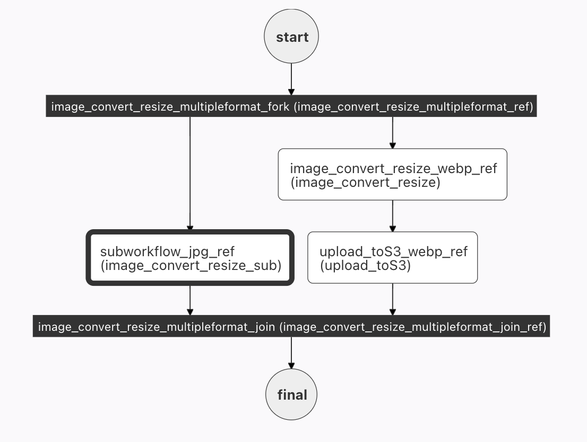

In our initial image processing workflow using Netflix Conductor, we [initially built a workflow](/content/blog/image-processing-workflow-with-conductor) that takes one image, resizes it and uploads it to S3.


In our 2nd post, we [utilized a fork to create two images in parallel](/content/blog/image-processing-multiple-images-forks).  When building this workflow, we reused all of the tasks from the first workflow, connecting them in a way that allowing for parallel processing of two images at once.


In both of these workflows, two tasks are reused: ```image_convert_resize``` and ```upload_toS3```.  This is one great advantage of using microservices - we create the service once, and reuse it many times in different ways.

In this post, we'll take that abstraction a step further, and replace the tasks in the two forks with a ```SUB_WORKFLOW```. This allows us to simplify the full workflow by abstracting a frequently used set of tasks into a single task.

<!--truncate -->

## Subworkflow

A [subworkflow](/content/docs/reference-docs/sub-workflow-task) is exactly what it sounds like: a fully functional workflow called inside a larger workflow.

There are a number of advantages to calling a sub-workflow:

1. Simplicity.  In the current case, we replace 2 tasks with one workflow.  In more complicated examples, the definition will be even further simplified. 
2. Continuity.  Our [simple workflow](image-processing-workflow-with-conductor) and [forked workflow](image-processing-multiple-images-forks) use the same tasks.  If a change is made to the simple workflow (but not the forked one) - the two workflows are now different - perhaps unintentionally.  If we utilize the ```simple workflow``` as a subworkflow - any changes to the workflow are immediately propagated to the forked workflow with no user intervention.

## Creating our Subworkflow

We want to use the ```image_convert_resize``` workflow already created in our [simple workflow](/content/blog/image-processing-workflow-with-conductor) example.  If you have not yet created this workflow (and the tasks that run under this workflow), you must first create a local Conductor instance, and then define this workflow (the instructions are in the blog post).  It's also a good idea to test this workflow before using as a subworkflow - just to make sure that it is working as expected :D.


## The (full) workflow

In this example, we'll utilize the ```image_convert_resize``` workflow as our subworkflow to simplify the JPG path of the forked workflow.  As you can see in the image below, the 2 tasks (resize and upload to S3) on the jpg flow are now replaced with the sub workflow.  The exact same result occurs, as the workflow is just an easier way to package the two tasks.




### The workflow code

The overall workflow is essentially the same as the one built in the [forked workflow](/content/blog/image-processing-multiple-images-forks):

```
{
  "name": "image_convert_resize_multipleformat",
  "description": "Image Processing Workflow",
  "version": 1,
  "tasks": [
    {
      "name": "image_convert_resize_multipleformat_fork",
      "taskReferenceName": "image_convert_resize_multipleformat_ref",
      "type": "FORK_JOIN",
      "forkTasks":[
        [
          <task 1 workflow>
        ],
        [
          <task 2 workflow>
        ]
      ]
    },
    {
      "name": "image_convert_resize_multipleformat_join",
      "taskReferenceName": "image_convert_resize_multipleformat_join_ref",
      "type": "JOIN",
      "joinOn": [
        "subworkflow_jpg_ref",
        "upload_toS3_webp_ref"
      ]
    }
    
  ],
  "outputParameters": {
    "fileLocationJpg": "${subworkflow_jpg_ref.output.fileLocation}",
    "fileLocationWebp": "${upload_toS3_webp_ref.output.fileLocation}"
  },
  "schemaVersion": 2,
  "restartable": true,
  "workflowStatusListenerEnabled": true,
  "ownerEmail": "devrel@orkes.io",
  "timeoutPolicy": "ALERT_ONLY",
  "timeoutSeconds": 0,
  "variables": {},
  "inputTemplate": {}
}

```

Two minor changes to the JSON have occurred - since the tasks on the jpg side of the workflow have changed. The ```joinOn``` in the join must use the subworkflow reference, and the ```outputParameters``` for the JPG will also point to the output of the subworkflow.


### Inserting the Subworkflow

Now to insert our subworkflow into the full workflow.  Here's the JSON that needs to be inserted (replacing ```<task 1 workflow>>```):

```
{
  "name": "image_convert_resize_sub",
  "taskReferenceName": "subworkflow_jpg_ref",
  "inputParameters": {
    "fileLocation": "${workflow.input.fileLocation}",
    "recipeParameters": {
      "outputSize": {
        "width": "${workflow.input.recipeParameters.outputSize.width}",
        "height": "${workflow.input.recipeParameters.outputSize.height}"
      },
      "outputFormat": "jpg"
    }
  },
  "type": "SUB_WORKFLOW",
  "decisionCases": {},
  "defaultCase": [],
  "forkTasks": [],
  "startDelay": 0,
  "subWorkflowParam": {
    "name": "image_convert_resize",
    "version": 1
  },
  "joinOn": [],
  "optional": false,
  "defaultExclusiveJoinTask": [],
  "asyncComplete": false,
  "loopOver": []
}
```

There's a name, and a taskReferenceName. Next, we have to supply the subworkflow with input parameters - the image location, new size, and (in this case) a hardcoded jpg format.  (This looks very similar to the code in the actual workflow itself.)

The type of this task is (unsurprisingly, I hope) ```SUB_WORKFLOW```, and the other very important parameter is the ```subWorkFlowParam``` which names the workflow to be run.


The full task can be seen in [Github](https://github.com/orkes-io/orkesworkers/blob/main/data/workflow/image_convert_resize_multipleformat_subworkflow.json).  In this case, there is not really a huge savings in terms of lines of code, but the savings will be realized in more complicated subworkflows.

#### The Webp subworkflow

Converting the 2 webp tasks to a subworkflow is not included in this post, but by copying the jpg subworkflow (and renaming all jpg references to webp), and replacing ```<task_t_workflow>```, you'll be in business.  Give it a try.

## Conclusion

Integrating subworkflows can simplify your workflow, allowing you to extract (and reuse) complex steps throughout your workflow.  They also have the added advantage of being easily updated - one change to the workflow will propagate automatically to every location it is referenced in all of your orchestration.


