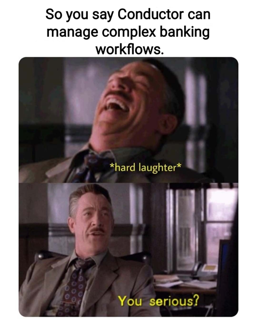
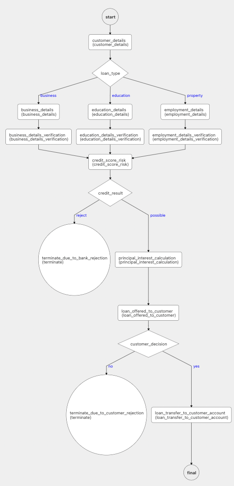
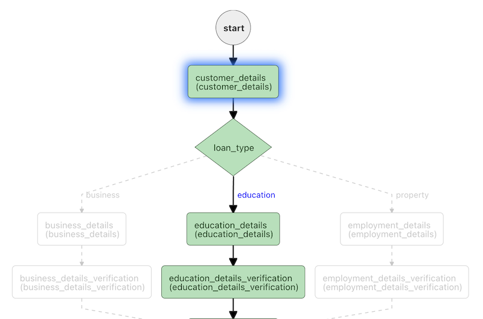
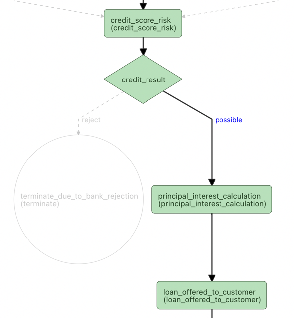
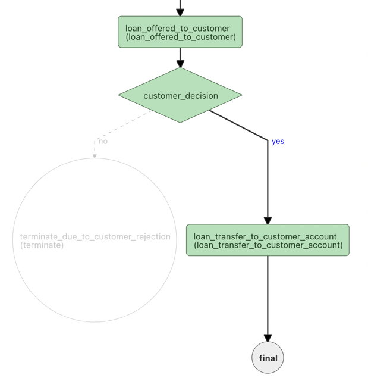
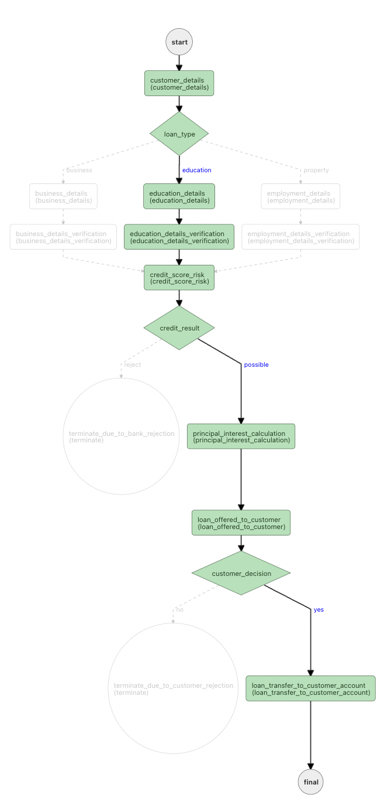
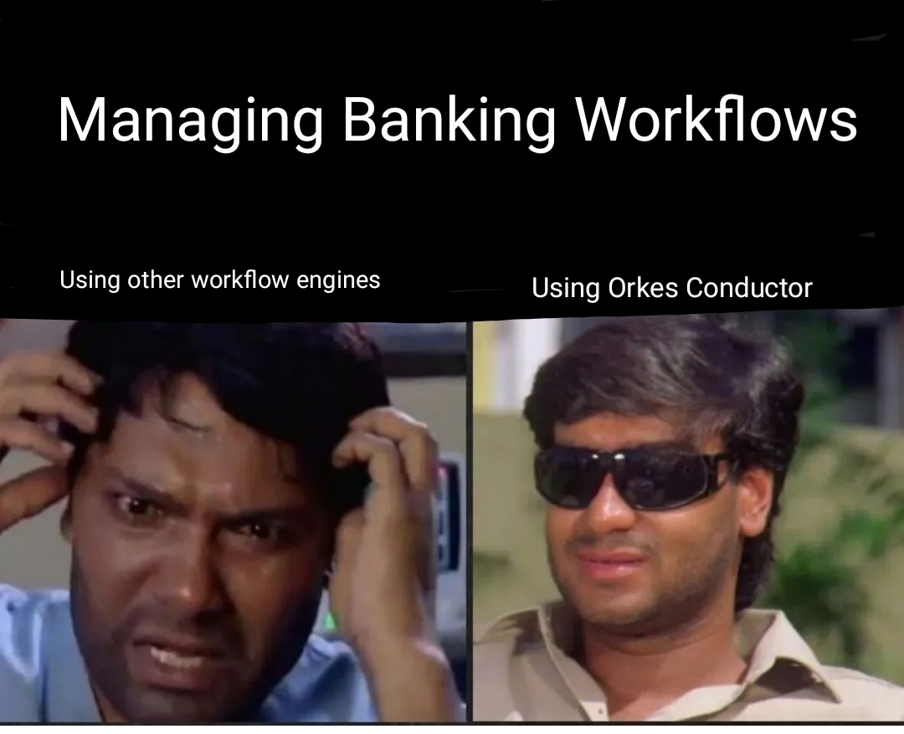

# Modern Loan Banking (Lending) Using Conductor

## Introduction

We got introduced to Conductor in the [Introduction](../docs/introduction) article. 

Let's now try to understand how we can use Conductor to solve a Lending problem that exists in Banking and Fintech sector. 

## Use Case / Problem

In this era of Fintech, bank customers are slowly moving from traditional banking to digital banking. Hence, in order to keep up with the customer demands various banks are trying to automate their banking processes and one among them is loan banking (lending) process to its customers. 

Lending workflows can be very common and potential problem that can be solved by the conductor.

#### Yes we are serious !!!!
#### JP Morgan Chase and American Express are already using conductor for their Banking needs !!!!

## Solution Using Conductor

Every Bank have their own set of rules in the area of Lending. This lending process is from Bank to the Customer, it depends on various factors that are evaluated and computed on details provided by the customer. On the basis of these details, banks measure the risk and offer loans to its customers on different parameters (for example - interest rate, tenure, EMIs, etc). This varies from Bank to Bank.

The complexities that banks go through behind the scenes to do the complex calculations, and on the top of that they have to maintain high level of security from potential threat, this all can be taken care by conductor.

#### Let's consider a simple workflow to understand how we can use features of Conductor in this Use Case :

This is an example of lending workflow in banks, there can be few complex tasks involved in this workflow. 
For now, we have created a workflow with only the most obvious and neccessary tasks.

The first task is `customer_details` , basic details (name, address, loan type,...) of the customer is fetched.

On the basis of loan type applied by the customer, `loan_type` a [switch-task](../docs/reference-docs/switch-task) makes decision of proceeding workflow.

#### If customer applies for education loan, the workflow looks like.

The workflow proceeds with the tasks `education_details` and `education_details_verification`. (Workflow would have went the other two ways if  `loanType : business`  or  `loanType : property`  were provided to the  `loan_type`  switch task). 

Education details of the customer are fetched in the task  `education_details`  and the details are verified in   `education_details_verification`  task.

Next up is calculating risk and this happens in the task `credit_score_risk` .   

There are various credit bureaus which release credit score for the customers on the basis of their credit history. 
If the credit score of the customer is below average score, banks don't give loans to the customers. 

The task `credit_score_risk`  fetches data from one of the credit bureau and generates the result on the basis of credit score and other parameters. 
Result can be - ` decision : possible`  if it possible to give loan and ` decision : reject` if it not possible to give loan.
On the basis of result generated by  `credit_score_risk`  the [switch_task](../docs/reference-docs/switch-task.md)  `credit_result`  proceeds the workflow. 

In the above diagram, the result generated is  `decision : possible`  hence, the workflow goes to the task  `principal_interest_calculation` (if the result was  `decision : reject`  the flow would have went to the task `terminate_due_to_bank_rejection`  which is a terminate task). 

In the task  `principal_interest_calculation`  the amount, duration, interest and other banking computations are done and in the next step  `loan_offered_to_the_customer`  details of the loan are sent to the customer and then the customer has to either accept it or reject it.

Whatever the Customer decision, on the basis of it the `customer_decision` a [(switch-task)](../docs/reference-docs/switch-task)  takes decision of proceeding the workflow. If Customer rejects, the workflow proceeds to the `terminate_due_to_customer_rejection)` a [(terminate-task)](../docs/reference-docs/terminate-task) and the workflow ends. If Customer accepts the loan offered by bank the workflow goes in the direction as shown in the above figure. And in the task  `loan_transfer_to_customer_account` money is transferred to the customer's account and workflow ends.

## Workflow after successful execution

## Thank You For Reading !!

