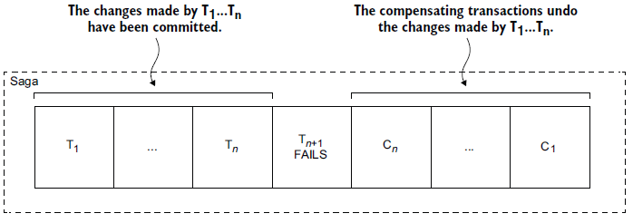

Microservice architecture is a popular approach to building large, complex software systems that consists of a collection of small, independent services that work together to deliver the functionality of the entire system. Each service is responsible for a specific task, and they communicate with each other through APIs or messaging systems.

One of the key benefits of microservice architecture is that it enables businesses to scale and evolve their software systems more quickly and efficiently than with monolithic architectures. However, it becomes important to maintain data consistency and preserve business rules across multiple services.

why a compensation transaction or rollback is critical for successful business rules setup in a microservice architecture-

Ensuring data consistency: Rollbacks and compensation transactions help maintain data consistency and prevent data inconsistencies caused by failed transactions.

1. Adhering to business rules: Business rules define constraints and requirements that govern the behavior of the system and ensure data accuracy and validity. Rollbacks and compensation transactions help adhere to these rules and prevent violations.

2. Handling complex transactions: Microservice architecture involves multiple services or databases, and transactions can span across them. Rollbacks and compensation transactions provide a safety net for complex transactions and ensure that data is not corrupted.

3. Increasing reliability: With the help of rollbacks and compensation transactions, businesses can increase the reliability and resilience of their microservice architecture and support critical business processes.

4. Saving time and resources: By preventing data inconsistencies and violations of business rules, rollbacks and compensation transactions save time and resources that would otherwise be spent on fixing errors and repairing data.

5. Enhancing user experience: By ensuring that transactions are processed accurately and completely, businesses can enhance user experience and maintain customer satisfaction.

6. Reducing risks: Rollbacks and compensation transactions reduce the risks associated with failed transactions and provide a safety net for businesses to operate smoothly.

7. Increasing agility: Microservice architecture provides businesses with the ability to respond quickly to changing market conditions. Rollbacks and compensation transactions increase agility by allowing businesses to modify transactions without fear of data corruption.

8. Facilitating scalability: Rollbacks and compensation transactions facilitate scalability by providing a safety net for transactions that involve multiple services or components.

9. Supporting regulatory compliance: Rollbacks and compensation transactions help businesses comply with regulatory requirements by ensuring that data is accurate and valid, and business rules are followed.


|[See the workflow in Orkes Playground](https://play.orkes.io/workflowDef/document_approval_test)|
|---|

Rollbacks are a critical mechanism for maintaining data consistency and preserving business rules in a microservice architecture. When a transaction is initiated, it can have multiple steps or operations that need to be executed in order to complete the transaction. A rollback is a mechanism that enables the system to undo these steps if an error or exception occurs during the transaction, ensuring that the data is consistent and the business rules are adhered to.

For example, let's consider an online shopping system that consists of multiple services, such as a product catalog service, a shopping cart service, and a payment processing service. When a customer adds a product to their shopping cart, a transaction is initiated that involves multiple services, such as checking the product availability in the catalog, updating the shopping cart, and processing the payment.

If any of these steps fails, a rollback can be initiated to undo the changes that were made, ensuring that the data remains consistent and the business rules are not violated. For instance, if the payment processing service fails to process the payment, the transaction can be rolled back to undo the changes made to the shopping cart and the product catalog.

While rollbacks are a powerful tool for maintaining data consistency and preserving business rules, they have some limitations. One of the biggest challenges with rollbacks is that they cannot always undo all the changes made by a transaction, especially when a transaction involves multiple services.

This is where compensation transactions come into play. A compensation transaction is a complementary mechanism to rollbacks that is used to compensate for changes made by a failed transaction. Compensation transactions are designed to undo the changes that were made by the failed transaction and restore the data to its original state.



For example, let's consider the same online shopping system mentioned earlier. If a transaction involving multiple services fails, a compensation transaction can be initiated to undo the changes made by the failed transaction and restore the data to its original state.

In practice, compensation transactions are often implemented as a separate workflow that is triggered when a transaction fails. The compensation workflow receives the failed transaction's ID and tasks as input, enabling you to implement compensating logic to handle the failure. The compensation workflow can undo the changes made by the failed transaction and restore the data to its original state.

Netflix Conductor is a popular open-source workflow orchestration engine that provides execution guarantees for microservice architectures. Conductor is designed to offer at least one delivery guarantee, ensuring that all messages are persistent, durable, and will be delivered to the task workers at least once. This model ensures that if a workflow has started, it will complete as long as all the tasks are completed. Additionally, if a task worker fails, the message is redelivered to another node that is alive and responding.

In your workflow definition, you should add the workflow name to be run on the failure of your current workflow:

```json
"failureWorkflow": "<name of the workflow to be run on failure>",
```

## Conclusion

Both rollbacks and compensation transactions are critical mechanisms for maintaining data consistency and preserving business rules in a microservice architecture. Rollbacks are used to undo the effects of a transaction when an error or exception occurs, while compensation transactions are used to perform additional actions to restore the system to its previous state. By implementing a robust transaction management system that can handle both rollbacks and compensation transactions effectively, businesses can ensure that their microservice architecture is reliable, resilient, and able to support their critical business processes.