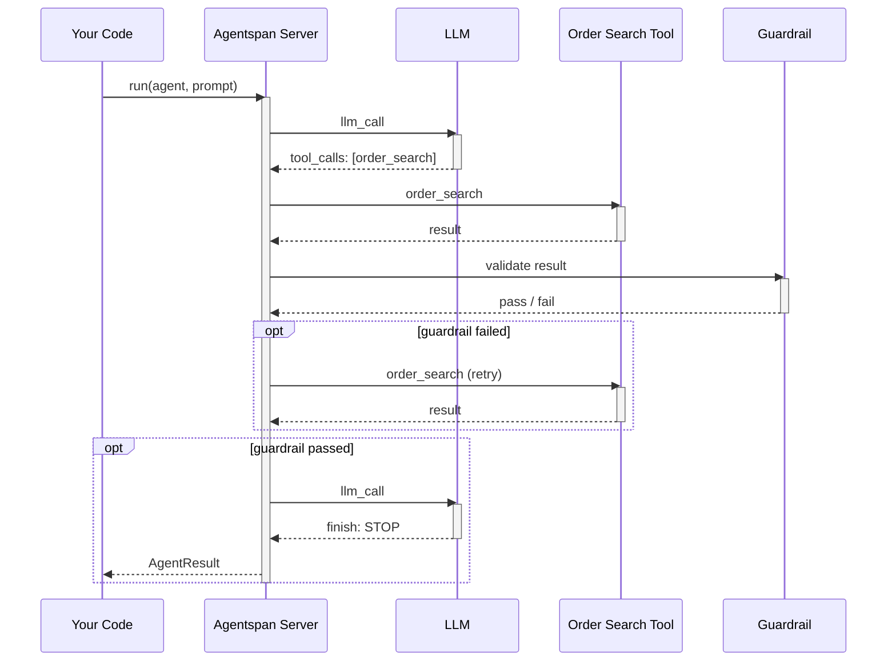
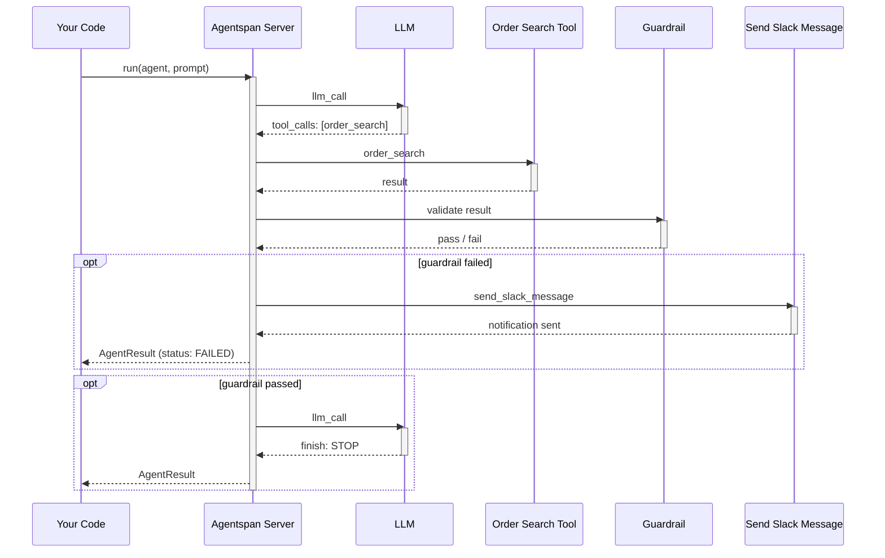
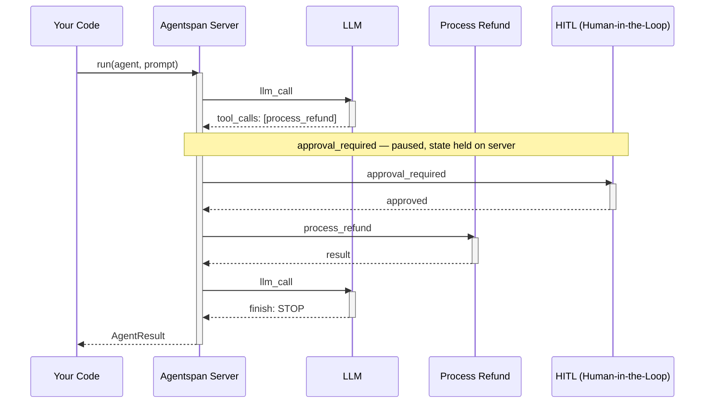

# Agents

`Agent` is the single orchestration primitive in Agentspan. A single agent wraps an LLM with tools. An agent with sub-agents IS a multi-agent system. There are no separate Team, Network, or Crew classes.

## Agent execution at runtime

The following diagrams show how the Agentspan server orchestrates different runtime behaviors — guardrail validation with retry and escalation, and human-in-the-loop approval.


**1. Retry** — the guardrail fails and the server re-invokes the same tool automatically.

**2. Escalation** — the guardrail fails and the server escalates by invoking a notification tool.

**3. Human-in-the-loop** — a tool marked `approval_required=True` pauses execution until a human approves or rejects.


## Import

```python
from conductor.ai.agents import Agent, AgentRuntime, run, start, stream
```

## Constructor

```python
Agent(
    name: str,                                       # Unique name (becomes workflow name)
    model: str,                                      # "provider/model" format
    instructions: Union[str, Callable] = "",          # System prompt
    tools: Optional[List] = None,                    # @tool functions or ToolDef
    agents: Optional[List[Agent]] = None,            # Sub-agents
    strategy: str = "handoff",                       # Multi-agent strategy
    router: Optional[Union[Agent, Callable]] = None, # For "router" strategy
    output_type: Optional[type] = None,              # Pydantic model for structured output
    guardrails: Optional[List[Guardrail]] = None,    # Input/output validation
    memory: Optional[ConversationMemory] = None,     # Session management
    dependencies: Optional[Dict[str, Any]] = None,   # Injected into ToolContext
    max_turns: int = 25,                             # Maximum agent loop iterations
    max_tokens: Optional[int] = None,                # LLM max tokens
    temperature: Optional[float] = None,             # LLM temperature
    stop_when: Optional[Callable] = None,            # Early termination condition
    metadata: Optional[Dict[str, Any]] = None,       # Arbitrary metadata
)
```

## Parameters

**`name`** — Unique identifier for this agent. Used in the execution UI, history queries, and `runtime.run("agent_name", prompt)` invocations. Required.

**`model`** — LLM in `"provider/model"` format. See [Providers](/developer-guides/agentspan/reference/providers) for all options.

```python
agent = Agent(name="bot", model="openai/gpt-4o")
agent = Agent(name="bot", model="anthropic/claude-sonnet-4-6")
agent = Agent(name="bot", model="google_gemini/gemini-2.0-flash")
```

**`instructions`** — System prompt. Can be a string or a callable that returns a string:

```python
# Static
Agent(name="bot", model="openai/gpt-4o", instructions="You are a helpful assistant.")

# Dynamic — evaluated at run time
from datetime import date
Agent(name="bot", model="openai/gpt-4o",
      instructions=lambda: f"Today is {date.today()}. You are a helpful assistant.")
```

**`tools`** — List of `@tool`-decorated functions, `http_tool()`, `mcp_tool()`, or `api_tool()` results. See [Tools](/developer-guides/agentspan/concepts/tools).

**`agents`** — Sub-agents for multi-agent orchestration. See [Multi-Agent](/developer-guides/agentspan/concepts/multi-agent).

**`strategy`** — How sub-agents are coordinated. Default: `"handoff"`. See [Multi-Agent](/developer-guides/agentspan/concepts/multi-agent).

**`output_type`** — A Pydantic `BaseModel` subclass for structured output:

```python
from pydantic import BaseModel
from conductor.ai.agents import Agent, AgentRuntime

class Report(BaseModel):
    title: str
    summary: str
    confidence: float

agent = Agent(name="analyst", model="openai/gpt-4o", output_type=Report)

with AgentRuntime() as runtime:
    result = runtime.run(agent, "Summarize the Q4 results")
    report: Report = result.output   # Fully typed
```

**`max_turns`** — Maximum iterations of the think-act-observe loop. Prevents runaway agents. Default: 25.

**`stop_when`** — Optional callable `(context: dict) -> bool`. Evaluated after each tool call. If it returns `True`, the agent stops early.

**`dependencies`** — Dict injected into tools via `ToolContext`:

```python
agent = Agent(
    name="bot", model="openai/gpt-4o",
    tools=[query_db],
    dependencies={"db": my_database, "user_id": "u-123"},
)
```

## Running Agents

### `AgentRuntime` context manager (recommended)

```python
from conductor.ai.agents import Agent, AgentRuntime

agent = Agent(name="assistant", model="openai/gpt-4o")

with AgentRuntime() as runtime:
    # Blocking — waits for result
    result = runtime.run(agent, "What is quantum computing?")
    result.print_result()

    # Fire-and-forget — returns immediately
    handle = runtime.start(agent, "Analyze this large dataset")

    # Streaming — yields events as they happen
    for event in runtime.stream(agent, "Write a poem"):
        print(event)
```

### Module-level functions

```python
from conductor.ai.agents import run, start, stream

result = run(agent, "Hello")       # Uses a shared singleton runtime
handle = start(agent, "Hello")
for event in stream(agent, "Hi"): ...
```

### Async variants

```python
from conductor.ai.agents import run_async, start_async, stream_async

result = await run_async(agent, "Hello")
handle = await start_async(agent, "Hello")
async for event in stream_async(agent, "Hi"): ...
```

## AgentResult

Returned by `run()`:

| Field | Type | Description |
|---|---|---|
| `output` | `Any` | Final answer (or Pydantic model if `output_type` set) |
| `workflow_id` | `str` | Execution ID — use to track in UI or reconnect |
| `status` | `str` | `"COMPLETED"`, `"FAILED"`, `"TERMINATED"`, `"TIMED_OUT"` |
| `messages` | `List[Dict]` | Full conversation history |
| `tool_calls` | `List[Dict]` | All tool invocations with inputs/outputs |
| `token_usage` | `Optional[TokenUsage]` | Aggregated token usage (populated via `AgentRuntime`) |
| `is_success` | `bool` | `True` if status is COMPLETED |
| `is_failed` | `bool` | `True` if status is FAILED |

```python
with AgentRuntime() as runtime:
    result = runtime.run(agent, "Summarize this")

print(result.output)           # The answer
print(result.workflow_id)     # Track in the Agentspan UI at http://localhost:6767
print(result.status)           # "COMPLETED"
print(result.token_usage)      # TokenUsage(prompt_tokens=..., completion_tokens=..., total_tokens=...)
```

> **Note:** `result.output` is the direct output value (string or Pydantic model). When using module-level `run()` without an `AgentRuntime`, `token_usage` is `None`.

## AgentHandle

Returned by `start()`. A handle to a running (or paused) execution:

| Method | Description |
|---|---|
| `get_status()` | Fetch current status → `AgentStatus` |
| `stream().get_result()` | Wait for the result |
| `approve()` | Approve a paused human-in-the-loop task |
| `reject(reason)` | Reject a HITL task with a reason |
| `send(message)` | Send a message to the agent (multi-turn) |
| `pause()` | Pause the execution |
| `resume()` | Resume a paused execution |
| `cancel(reason)` | Cancel the execution |
| `workflow_id` | The execution ID (attribute) |

```python
with AgentRuntime() as runtime:
    handle = runtime.start(agent, "Analyze Q4 reports")

print(handle.workflow_id)     # Store this to reconnect later

# Poll status
status = handle.get_status()
if status.is_waiting:
    handle.approve()
elif status.is_complete:
    print(status.output)
```

### Reconnect to an existing execution

```python
from conductor.ai.agents import AgentHandle, AgentRuntime

runtime = AgentRuntime()
runtime.serve(agent, blocking=False)   # Start workers for @tool functions

handle = AgentHandle(workflow_id="exec-abc123", runtime=runtime)
status = handle.get_status()
```

> **Critical:** When reconnecting to a run that uses `@tool` functions, call `runtime.serve(agent, blocking=False)` **before** creating the `AgentHandle`. Otherwise tool tasks will hang.

## Pipeline Composition

The `>>` operator creates sequential pipelines:

```python
researcher = Agent(name="researcher", model="openai/gpt-4o",
                   instructions="Research the topic.")
writer = Agent(name="writer", model="openai/gpt-4o",
               instructions="Write an article from the research.")
editor = Agent(name="editor", model="openai/gpt-4o",
               instructions="Polish the article for publication.")

pipeline = researcher >> writer >> editor

with AgentRuntime() as runtime:
    result = runtime.run(pipeline, "AI agents in 2025")
    result.print_result()
```

## Dry-run / Plan

Compile the agent without executing it:

```python
from conductor.ai.agents import plan

workflow = plan(agent)
print(workflow)    # Compiled workflow definition (server-side execution graph)
```

---

## Execution engine

Agentspan compiles agent definitions into [Conductor](https://conductor-oss.org/) workflows — an open-source orchestration engine that has run billions of executions in production at Netflix, LinkedIn, and Tesla. Durable state, per-step retries, replay, and full execution history are Conductor primitives. `AgentRuntime`, `Agent`, and `@tool` are the Agentspan API on top of that foundation.
