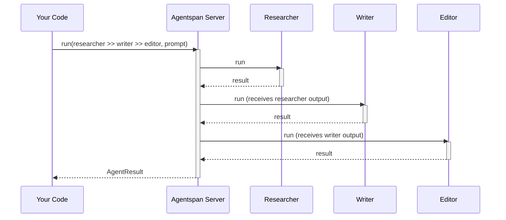
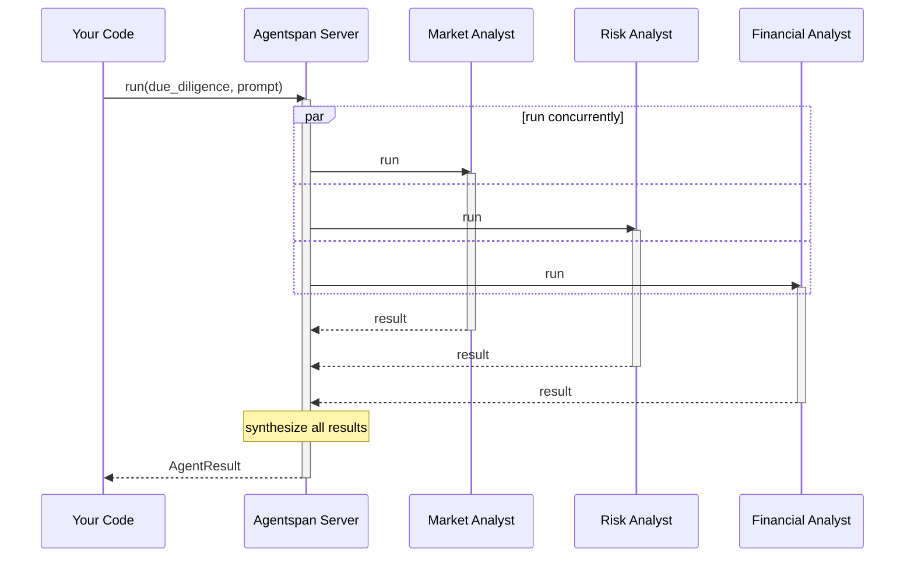
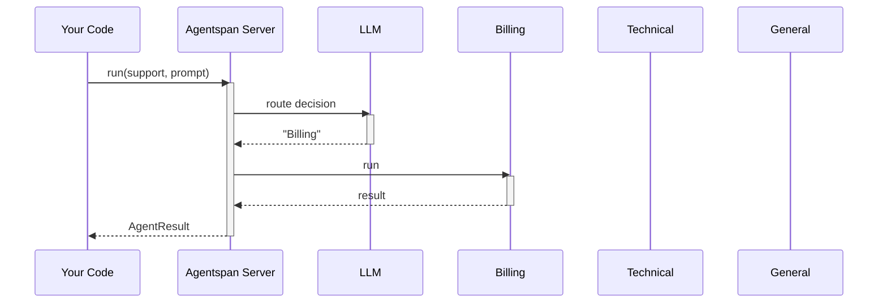
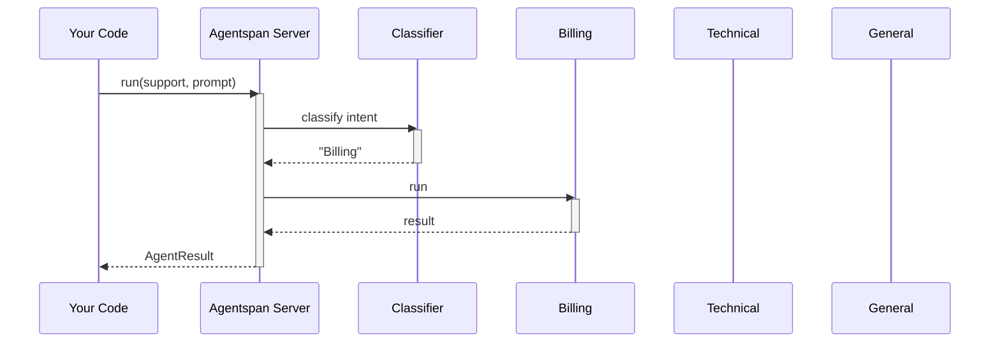
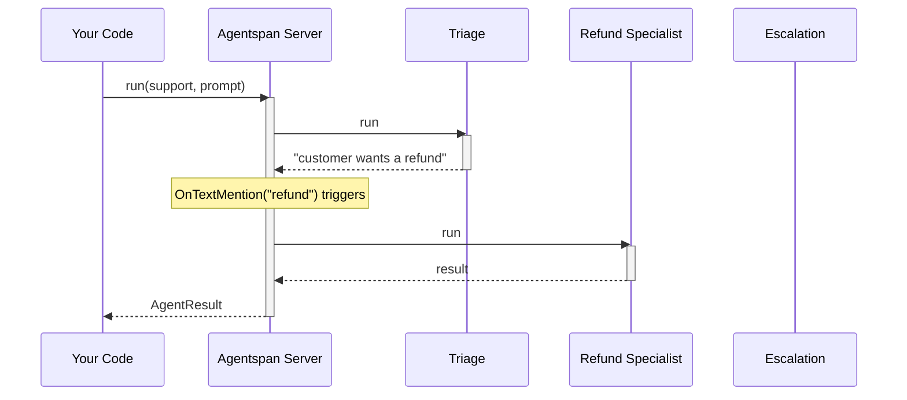
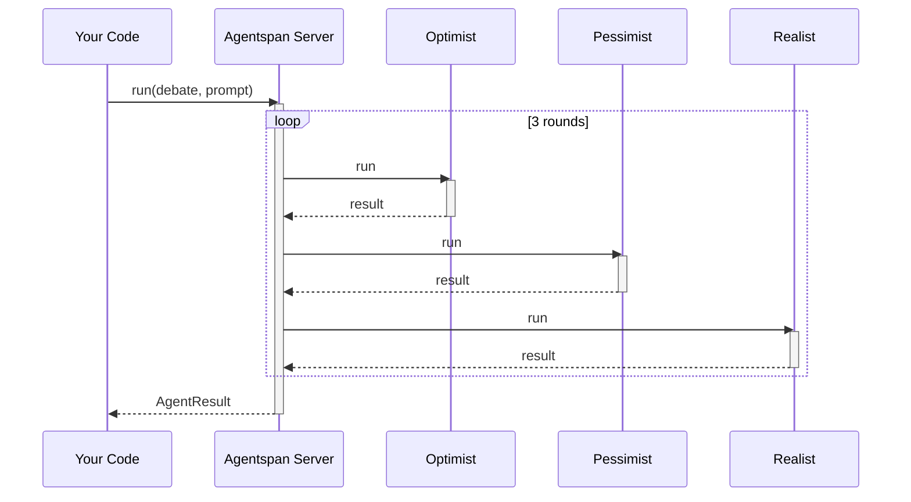
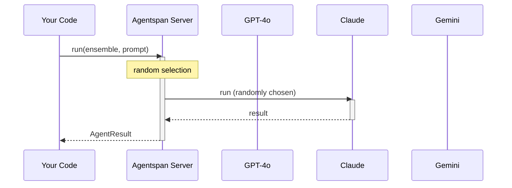
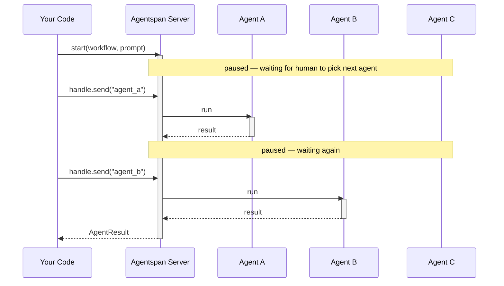
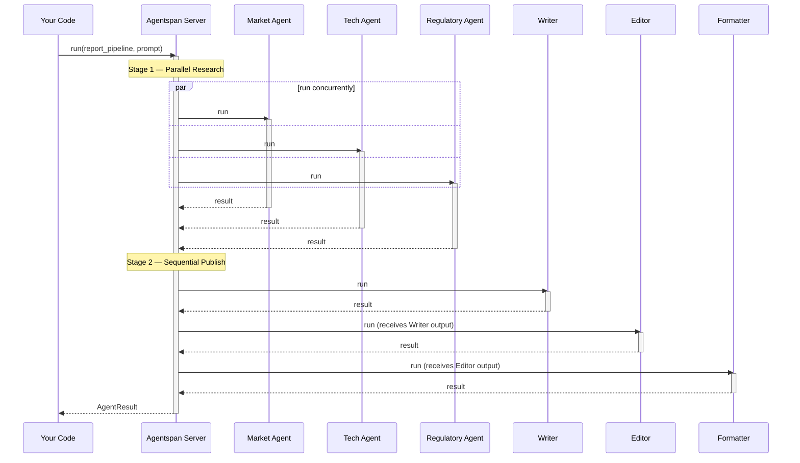

# Multi-Agent Strategies

Every multi-agent system in Agentspan is built from one primitive: `Agent`. Set `agents=[...]` and choose a `strategy` to coordinate them.

## Overview

| Strategy | Description |
|---|---|
| `handoff` (default) | LLM chooses which sub-agent handles the request |
| `sequential` | Sub-agents run in order, output feeds forward |
| `parallel` | All sub-agents run concurrently, results aggregated |
| `router` | A router agent or function selects which sub-agent runs |
| `swarm` | Condition-based handoffs between agents |
| `round_robin` | Agents take turns in a fixed rotation |
| `random` | Random sub-agent selection each turn |
| `manual` | Human selects which agent speaks each turn |

## Sequential — `a >> b >> c`

Sub-agents run in order. Each agent's output becomes the next agent's input.



```python
from agentspan.agents import Agent, AgentRuntime

researcher = Agent(name="researcher", model="openai/gpt-4o",
                   instructions="Research the topic and provide key facts.")
writer = Agent(name="writer", model="openai/gpt-4o",
               instructions="Write an engaging article from the research.")
editor = Agent(name="editor", model="openai/gpt-4o",
               instructions="Polish the article for publication.")

# Operator syntax
pipeline = researcher >> writer >> editor

# Equivalent constructor syntax
pipeline = Agent(
    name="pipeline",
    model="openai/gpt-4o",
    agents=[researcher, writer, editor],
    strategy="sequential",
)

with AgentRuntime() as runtime:
    result = runtime.run(pipeline, "AI agents in software development")
    result.print_result()
```

## Parallel

All sub-agents run concurrently. Results are aggregated into `result.sub_results`.



```python
from agentspan.agents import Agent, AgentRuntime

market = Agent(name="market", model="openai/gpt-4o",
               instructions="Analyze market size, growth, and key players.")
risk = Agent(name="risk", model="openai/gpt-4o",
             instructions="Analyze regulatory, technical, and competitive risks.")
financial = Agent(name="financial", model="openai/gpt-4o",
                  instructions="Analyze financial projections and metrics.")

analysis = Agent(
    name="analysis",
    model="openai/gpt-4o",
    agents=[market, risk, financial],
    strategy="parallel",
)

with AgentRuntime() as runtime:
    result = runtime.run(analysis, "Launching an AI healthcare tool in the US")
    print(result.sub_results["market"])
    print(result.sub_results["risk"])
    print(result.sub_results["financial"])
```

## Handoff (default)

The orchestrator LLM decides which sub-agent handles the request. Sub-agents can also hand off to each other.



```python
from agentspan.agents import Agent, AgentRuntime, tool

@tool
def check_balance(account_id: str) -> dict:
    """Check account balance."""
    return {"account_id": account_id, "balance": 5432.10}

billing = Agent(name="billing", model="openai/gpt-4o",
                instructions="Handle billing inquiries.", tools=[check_balance])
technical = Agent(name="technical", model="openai/gpt-4o",
                  instructions="Handle technical issues.")

support = Agent(
    name="support",
    model="openai/gpt-4o",
    instructions="Route customer requests to the right team.",
    agents=[billing, technical],
    strategy="handoff",   # This is the default
)

with AgentRuntime() as runtime:
    result = runtime.run(support, "What's the balance on account ACC-123?")
    result.print_result()
```

## Router

A dedicated router agent or function selects which sub-agent runs:



```python
from agentspan.agents import Agent, AgentRuntime

classifier = Agent(
    name="classifier",
    model="openai/gpt-4o-mini",
    instructions="Classify the request as 'billing', 'technical', or 'general'. Reply with just the category.",
)

billing = Agent(name="billing", model="openai/gpt-4o",
                instructions="Handle billing inquiries.")
technical = Agent(name="technical", model="openai/gpt-4o",
                  instructions="Handle technical issues.")
general = Agent(name="general", model="openai/gpt-4o",
                instructions="Handle general questions.")

support = Agent(
    name="support",
    model="openai/gpt-4o",
    agents=[billing, technical, general],
    strategy="router",
    router=classifier,
)

with AgentRuntime() as runtime:
    result = runtime.run(support, "My invoice has a wrong charge")
    result.print_result()
```

You can also use a Python function as the router:

```python
def route(prompt: str) -> str:
    """Return the name of the agent to route to."""
    if "bill" in prompt.lower() or "invoice" in prompt.lower():
        return "billing"
    elif "error" in prompt.lower() or "bug" in prompt.lower():
        return "technical"
    return "general"

support = Agent(
    name="support",
    model="openai/gpt-4o",
    agents=[billing, technical, general],
    strategy="router",
    router=route,
)
```

## Swarm

Condition-based handoffs between agents. Each agent can trigger a handoff based on text patterns or other conditions:



```python
from agentspan.agents import Agent, AgentRuntime, Strategy
from agentspan.agents import TextMentionTermination

triage = Agent(name="triage", model="openai/gpt-4o",
               instructions="Triage support requests. Say 'BILLING' for billing, 'TECH' for technical.")
billing = Agent(name="billing", model="openai/gpt-4o",
                instructions="Handle billing inquiries.")
technical = Agent(name="technical", model="openai/gpt-4o",
                  instructions="Handle technical issues.")

team = Agent(
    name="support_team",
    model="openai/gpt-4o",
    agents=[triage, billing, technical],
    strategy=Strategy.SWARM,
    handoffs=[
        TextMentionTermination("BILLING", target="billing"),
        TextMentionTermination("TECH", target="technical"),
    ],
)
```

## Round Robin

Agents take turns in a fixed rotation:



```python
agent1 = Agent(name="agent1", model="openai/gpt-4o",
               instructions="You are the first debater. Argue for AI regulation.")
agent2 = Agent(name="agent2", model="openai/gpt-4o",
               instructions="You are the second debater. Argue against AI regulation.")

debate = Agent(
    name="debate",
    model="openai/gpt-4o",
    agents=[agent1, agent2],
    strategy="round_robin",
    max_turns=6,   # 3 rounds each
)

with AgentRuntime() as runtime:
    result = runtime.run(debate, "Begin the debate.")
    result.print_result()
```

## Random

A random sub-agent is selected each turn. Useful for load balancing across models or creating diverse output ensembles.



```python
ensemble = Agent(
    name="diverse_writers",
    agents=[
        Agent(name="gpt4", model="openai/gpt-4o", instructions="Write concisely."),
        Agent(name="claude", model="anthropic/claude-sonnet-4-6", instructions="Write creatively."),
        Agent(name="gemini", model="google_gemini/gemini-2.0-flash", instructions="Write with examples."),
    ],
    strategy="random",
)

with AgentRuntime() as runtime:
    result = runtime.run(ensemble, "Explain why consistency matters in distributed systems")
    result.print_result()
```

## Manual

Execution pauses between turns waiting for explicit human selection of the next agent. Useful for human-directed workflows.



```python
from agentspan.agents import Agent, AgentRuntime, start

workflow = Agent(
    name="manual_workflow",
    agents=[agent_a, agent_b, agent_c],
    strategy="manual",
)

with AgentRuntime() as runtime:
    handle = runtime.start(workflow, "initial prompt")
    # Manual strategy pauses at each turn waiting for input.
    # Use handle.send(agent_name) to select which agent runs next.
    status = handle.get_status()
    if status.is_waiting:
        handle.send("agent_a")  # send the name of the agent to invoke
```

## Termination Conditions

Control when multi-agent loops stop:

```python
from agentspan.agents import (
    MaxMessageTermination,
    TextMentionTermination,
    StopMessageTermination,
    TokenUsageTermination,
)

# Stop after 20 messages
MaxMessageTermination(max_messages=20)

# Stop when an agent says "DONE"
TextMentionTermination("DONE")

# Stop on StopMessage events
StopMessageTermination()

# Stop when token budget is exceeded
TokenUsageTermination(max_total_tokens=10000)
```

Combine multiple conditions:

```python
from agentspan.agents import Agent

agent = Agent(
    name="team",
    model="openai/gpt-4o",
    agents=[agent1, agent2],
    strategy="round_robin",
    stop_when=MaxMessageTermination(20) | TextMentionTermination("DONE"),
)
```

## Nested Strategies

Strategies compose freely — a parallel agent can contain sequential pipelines:



```python
research_pipeline = researcher >> writer

analysis = Agent(
    name="analysis",
    model="openai/gpt-4o",
    agents=[research_pipeline, financial_agent, risk_agent],
    strategy="parallel",
)
```
