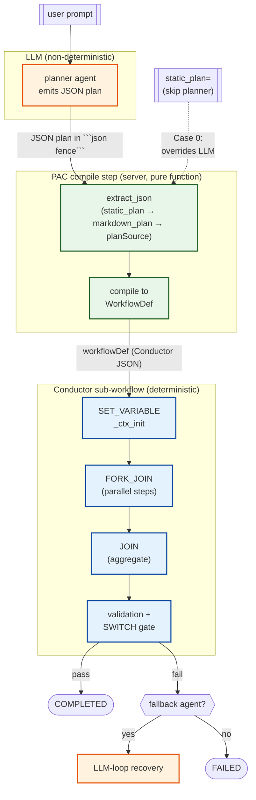
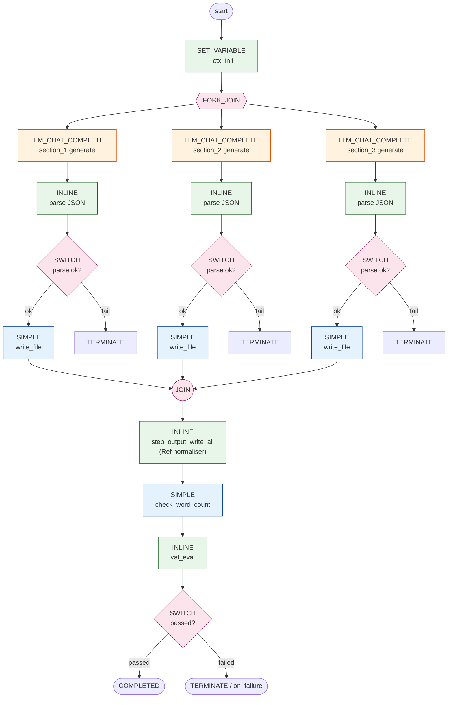

# Plan-Execute Strategy

`Strategy.PLAN_EXECUTE` (also called PAE; the server-side compiler is PAC, "PLAN_AND_COMPILE") splits a task into two phases:

1. **Plan** — a planner agent emits a JSON DAG of operations.
2. **Execute** — the server compiles that JSON into a Conductor sub-workflow and runs it deterministically.

The LLM is only invoked where it adds value (planning, per-op content generation). Orchestration, retries, parallelism, and validation are pure Conductor primitives — no token cost, no nondeterminism.

## The deterministic boundary

The whole point of PAC/PAE is to draw a hard line between the **non-deterministic part** (the planner LLM reasoning about *what to do*) and the **deterministic part** (Conductor running the compiled DAG). Once the plan is compiled, the executor is replay-safe, branch-stable, and free of LLM randomness.



**Why this shape gives you determinism:**

- **One planner call, then we're done with the LLM.** The plan is a value; everything downstream is a function of that value. Two identical plans produce two identical workflow defs and two identical executions (modulo tool side effects).
- **`Ref("step_id")` is resolved at compile time**, not at run time — there is no runtime "interpret-the-plan" loop that could diverge. The wire form (`{"$ref": "fetch"}`) becomes a Conductor template (`${fetch.output.result}`) once, in PAC.
- **Branching is a SWITCH, not a re-prompt.** `success_condition` is a JS expression evaluated by Conductor's JavaScript engine — same input, same branch, every time.
- **Parallelism is FORK_JOIN, not "ask the LLM to fan out".** A 5-section parallel report has exactly 5 branches, deterministically.
- **`plan=` (static plan) bypasses the LLM entirely.** Workflow shape and execution are now fully determined by your code. Use this for tests, replays, or any pipeline where planning lives outside the agent.

## When to use it

PLAN_EXECUTE wins when the work has **fixed structure but variable content**:

- Generate a research report (3 sections, parallel writes, then assemble + validate)
- Process a batch of records with conditional branches
- Multi-stage refactor where each stage is the same shape but the inputs differ
- Anywhere you'd otherwise hand-write 20 turns of LLM tool-calling and hope it doesn't loop

If you need fully agentic exploration with no fixed shape, use `Strategy.HANDOFF` instead. If you have a fully fixed pipeline, use `Strategy.SEQUENTIAL`. PLAN_EXECUTE is the middle ground.

## The shape

```python
from agentspan.agents import Strategy, Agent, plan_execute

# One-call construction (recommended):
harness = plan_execute(
    name="report_generator",
    tools=[create_directory, write_file, assemble_files, check_word_count],
    planner_instructions="Plan a research report on the user's topic. Use 3 sections, then assemble.",
    fallback_instructions="The deterministic plan failed — recover agentically.",
)

# Or assemble manually if you need every knob:
planner = Agent(name="planner", instructions=PLANNER_INSTRUCTIONS, model=...)
fallback = Agent(name="fb", instructions=FALLBACK_INSTRUCTIONS, tools=[...], model=...)
harness = Agent(
    name="report_generator",
    strategy=Strategy.PLAN_EXECUTE,
    planner=planner,
    fallback=fallback,
    tools=[...],         # canonical plan-executable set; PAC validates against this
    fallback_max_turns=5,
)
```

The **planner**, **fallback**, and **tools** slots are the three first-class fields. `agents=[...]` is **not** valid for PLAN_EXECUTE — set the named slots.

## Plan schema

The server auto-appends a `## Plan schema` block to the planner's user prompt (along with `## Available tools` derived from `harness.tools`). Your `planner_instructions` only needs to cover **domain-level guidance** — what to plan, not how to format JSON.

The schema PAC consumes:

```json
{
  "steps": [
    {
      "id": "<unique step id>",
      "depends_on": ["<other step id>"],
      "parallel": false,
      "operations": [
        {"tool": "<tool>", "args": {<literal arg map>}},
        {"tool": "<tool>", "generate": {
          "instructions": "<what the LLM should produce>",
          "output_schema": "<JSON shape that becomes the tool's args>",
          "max_tokens": 4096
        }}
      ]
    }
  ],
  "validation": [
    {"tool": "<validator>", "args": {...},
     "success_condition": "$.passed === true"}
  ],
  "on_success": [{"tool": "<tool>", "args": {...}}],
  "on_failure": [{"tool": "<tool>", "args": {...}}]
}
```

**Key concepts:**

- **`args` vs `generate`** — `args` runs the tool with literal values you decide at plan time. `generate` defers arg construction to a per-op LLM call at run time.
- **`depends_on`** — cross-step concurrency. A step starts when *all* listed deps complete. Defaults to the previous step.
- **`parallel`** — when true, the step's own `operations` run concurrently (FORK_JOIN). Without it, operations run in order within the step.
- **`success_condition`** — JS expression evaluated against the validator's output (`$` = parsed output map). Returns truthy on pass.
- **`on_success` / `on_failure`** — tools to run after validation. Optional.

## Typed plans (no JSON soup)

For static plans (or plans you build programmatically), import the typed builders:

```python
from agentspan.agents import Plan, Step, Op, Generate, Validation, Action

plan = Plan(
    steps=[
        Step("setup", operations=[Op("create_directory", args={"path": "out"})]),
        Step(
            "write",
            depends_on=["setup"],
            parallel=True,
            operations=[
                Op("write_file", generate=Generate(
                    instructions="Write the introduction.",
                    output_schema='{"path": "out/intro.md", "content": "..."}',
                )),
            ],
        ),
    ],
    validation=[
        Validation("check_word_count", args={"path": "out/intro.md", "min_words": 200}),
    ],
)
```

IDE autocomplete, Pylance type-checks, no escaping nightmares.

## Output → input across steps with `Ref`

Wire the **whole output** of one step into the args of a later step with `Ref("step_id")`. No JSON path, no field selection, no Conductor task-ref naming to memorise.

```python
from agentspan.agents import Op, Plan, Ref, Step

plan = Plan(steps=[
    Step("fetch", operations=[Op("fetch_data", args={"url": URL})]),
    Step(
        "summarize",
        depends_on=["fetch"],
        operations=[
            # The whole dict returned by `fetch_data` becomes the value of
            # the `document` arg passed to `summarize`. No `.result` suffix,
            # no JSONPath — the SDK serialises Ref(...) to {"$ref": "fetch"}
            # and the server rewrites it to the right Conductor template
            # against an INLINE wrapper that normalises dict vs. wrapped
            # worker returns.
            Op("summarize", args={"document": Ref("fetch")}),
        ],
    ),
])
```

Rules:

- The referenced step must be declared in this step's `depends_on` — explicit beats implicit. The server's PAC compile step rejects plans that Ref a step they don't depend on (the typed-Plan builders ship the Ref to the wire as-is; the failure surfaces at workflow start, not in your IDE).
- The referenced step must exist in the plan.
- Self-Refs (`Ref(stepId)` from inside `stepId`) are a compile error.
- A step can Ref multiple upstream steps independently — `Op("report", args={"src": Ref("fetch"), "summary": Ref("summarize")})` works.
- For a `parallel=True` step, `Ref("step_id")` resolves to the **array of branch results** (the FORK_JOIN aggregator's payload).
- Refs work inside nested args (lists, nested dicts) — the serialiser walks the whole arg tree.

See `examples/108_plan_execute_refs.py` for a three-step pipeline that pipes one step's record dict through two downstream steps without ever spelling out a JSONPath.

## Static plans — skip the planner LLM

Pass a `Plan` (or a raw dict in the same shape) to `runtime.run` and PAC uses it directly:

```python
result = runtime.run(harness, "anything", plan=plan, cwd=work_dir)
```

The planner LLM still runs (the workflow shape is fixed at compile time) but its output is discarded — PAC's `extract_json` reads `workflow.input.static_plan` as Case 0, which wins over planner output. Use this for:

- Tests (deterministic plan, no LLM nondeterminism)
- Replays of a previously-emitted plan
- Pipelines where planning lives outside the agent (a separate service or a code path that builds the `Plan` object)

## Tool guardrails propagate

`@tool(guardrails=[...])` works inside PLAN_EXECUTE the same way it works in the LLM-loop:

```python
no_pii = RegexGuardrail(patterns=[r"\b\d{16}\b"], on_fail=OnFail.RAISE, ...)

@tool(guardrails=[no_pii])
def send_email(to: str, body: str) -> str: ...
```

PAC wraps every emitted SIMPLE for `send_email` in a guardrail SWITCH gate. The bare SIMPLE only runs from the gate's `pass` branch. If the guardrail trips:

- `on_fail=raise` — TERMINATE the dynamic plan; harness's `fallback` agent recovers
- `on_fail=retry` / `fix` / `human` — collapse to TERMINATE in plan mode; same fallback path. (See `OnFail` docstring for full semantics — there's no LLM loop in plan mode to feed retry feedback into; the fallback IS the retry loop.)

The compiler emits **only the SWITCH cases that are reachable** for the configured `on_fail`. An `on_fail=raise` guardrail produces one `raise` case, not four dead branches.

## Fallback — the recovery agent

Configure `fallback=<Agent>` on the harness for adaptive recovery when:

- The planner emits a malformed plan (PAC validation fails)
- A guardrail trips on a deterministic step
- A plan step itself fails at run time

The fallback runs as a normal LLM-loop agent with the harness's `tools`. It receives the original prompt + the failure context (planner output, error message). `fallback_max_turns` caps its turn count during recovery.

Without a fallback, any failure terminates the workflow. Acceptable for fail-loud pipelines; surprising otherwise — PAC **refuses to compile** when guardrails with `on_fail=retry|fix|human` are configured but no fallback exists, forcing you to either configure a fallback or explicitly set `on_fail=raise` to acknowledge fail-closed semantics.

## What PAC actually emits

For a plan with N parallel steps + 1 validator, the compiled WorkflowDef looks roughly like:

```
SET_VARIABLE      _ctx_init
FORK_JOIN         (per-step branches)
  LLM_CHAT_COMPLETE  (per generate op)
  INLINE             (parse LLM JSON output)
  SWITCH             (parse-error gate)
  SIMPLE             (the tool call)
JOIN
INLINE            (aggregate parallel branch results — only if downstream reads it)
SIMPLE            (validator)
INLINE            (val_eval — emits "passed"/"failed")
SWITCH vsw        ("passed" → on_success, default → TERMINATE/on_failure)
```

Visually, for a 3-section parallel-write plan with one validator:



Only the orange `LLM_CHAT_COMPLETE` nodes are non-deterministic. Everything else — parse, gate, tool call, aggregate, validate, branch — is pure Conductor and replay-safe. With a **static plan** (`plan=` argument), the planner LLM call up-front is elided too, leaving a fully deterministic pipeline.

The `## Available tools` block in the planner prompt and PAC's validator share the same source: `harness.tools`. A planner can't emit a tool name that PAC will reject (and PAC will reject anything not in the harness's set — closes the hallucinated-tool-name bug).

## Common patterns

### Research report (LLM-driven planning)

```python
harness = plan_execute(
    name="report",
    tools=[create_directory, write_file, assemble_files, check_word_count],
    planner_instructions="Plan a research report on the user's topic. Use 3 sections.",
    fallback_instructions="Fix what the deterministic plan couldn't.",
)
result = runtime.run(harness, "AI agents in 2025")
```

### Static pipeline (no planner reasoning needed)

```python
harness = plan_execute(name="ingest", tools=[fetch, transform, store])
plan = Plan(steps=[
    Step("fetch", operations=[Op("fetch", args={"url": url})]),
    Step("transform", depends_on=["fetch"], operations=[Op("transform", args={"path": "raw.json"})]),
    Step("store", depends_on=["transform"], operations=[Op("store", args={"key": "result"})]),
])
result = runtime.run(harness, "ingest job", plan=plan)
```

### Parallel work + validation

```python
plan = Plan(
    steps=[
        Step("setup", operations=[Op("create_directory", args={"path": "out"})]),
        Step("write_all", depends_on=["setup"], parallel=True, operations=[
            Op("write_file", generate=Generate(
                instructions=f"Write section {i}.",
                output_schema=f'{{"path": "out/{i}.md", "content": "..."}}',
            ))
            for i in range(5)
        ]),
        Step("assemble", depends_on=["write_all"], operations=[
            Op("assemble_files", args={"output_path": "report.md", "input_paths": "..."})
        ]),
    ],
    validation=[Validation("check_word_count", args={"path": "report.md", "min_words": 1000})],
)
```

## Planner context — ground the planner in your domain rules

The planner's `instructions` are fine for "how to emit a plan." They're a poor fit for the *domain-specific rules* a real plan depends on: KYC tier thresholds, onboarding phase ordering, compliance escalation paths, region-specific exceptions. Those live in docs that change weekly — not in code that ships quarterly.

`planner_context` injects those rules into the planner's user prompt at runtime, as a `## Reference Context` block. Two entry shapes:

```python
from agentspan.agents import Agent, Context, Strategy

harness = Agent(
    name="onboarding_harness",
    strategy=Strategy.PLAN_EXECUTE,
    tools=[validate_kyc, create_account, send_welcome_email],
    planner=planner,
    fallback=fallback,
    planner_context=[
        # 1) Inline text — short, stable, hand-edited in code.
        "Onboarding has 3 mandatory phases in order: validate_kyc → create_account → send_welcome_email.",
        "Tier 'enterprise' customers ADDITIONALLY require schedule_kickoff_call.",

        # 2) Live doc — fetched per planner invocation, no compile-time fetch, no cache.
        #    Authorization placeholders use the same `${CRED}` shape as ToolConfig.headers.
        Context(
            url="https://confluence.example.com/onboarding-rules",
            headers={"Authorization": "Bearer ${CONFLUENCE_TOKEN}"},
            required=True,    # fetch failure → workflow fails (default)
            max_bytes=8192,   # truncate at 8KB + add a [doc truncated] marker
        ),
    ],
)
```

**How it compiles.** Each URL entry emits a `PLANNER_CONTEXT_FETCH` system task inside the planner-route's *live* branch (the static-plan path skips it for free). With ≥2 URLs the fetches are wrapped in a `FORK_JOIN` so they run in parallel. A small in-process TTL cache (default 60 s) plus `If-None-Match`/ETag means repeat fetches for the same doc within the TTL return the cached body without touching the wire — and 304 responses refresh the TTL without re-downloading.

**Cache scope.** Cache key is `(url, sorted-headers)`, so different `Authorization` headers (different principals) never share a cache entry. Bounded LRU at ~1024 entries.

**Credential placeholders.** `${CRED_NAME}` in headers gets escaped server-side to `#{CRED_NAME}` so Conductor's templater leaves it alone; the runtime credential resolver fills the value at request time — same pipeline as HTTP tool headers. Headers containing `CR`/`LF` are rejected at compile time to close the HTTP-response-splitting injection vector.

**Failure handling.** `required=True` (default) hard-fails the workflow on fetch error. `required=False` substitutes a `[doc unavailable]` marker in the planner prompt so the planner runs on partial context — for "nice-to-have" docs (glossaries, FAQs).

End-to-end demo: `examples/115_plan_execute_planner_context.py` (Python; mirrored to TS / Java / C#).

## Inspecting compiled plans

`POST /api/agent/inspect-plan` compiles a plan against a PLAN_EXECUTE harness config and returns the resulting Conductor `WorkflowDef` + error string + warnings + stats — **without dispatching the SUB_WORKFLOW**. Useful for:

* IDE tooling validating that a plan compiles cleanly against a fixed agent config before deploy
* Plan-debug REPLs visualizing the compiled DAG
* CI checks that verify a static plan still compiles after agent-config or tool-schema changes

Request shape:

```json
{
  "agentConfig": { /* same shape as POST /agent/start */ },
  "plan": { "steps": [ { "id": "...", "operations": [ ... ] } ] }
}
```

Response includes the same fields PAC sets on `output` at execution time (`workflowDef`, `error`, `warnings`, `stats`) — uses the production compile path, so the inspected output is byte-equal to what a real run would produce for that plan.

## Knobs reference

| Field | Purpose |
|---|---|
| `planner=` | Required. The agent that emits the JSON plan. |
| `fallback=` | Optional. Agentic recovery when a plan can't compile/exec. |
| `tools=` | Required. Plan-executable tool set. PAC validates `op.tool` names against this list and propagates each tool's guardrails. |
| `planner_context=` | Optional. List of `Context(text=…)` / `Context(url=…)` entries appended to the planner's user prompt as `## Reference Context`. URLs fetched per-planner-invocation with TTL cache + ETag revalidation. See "Planner context" above. |
| `fallback_max_turns=` | Caps the fallback agent's turn count during recovery. |
| `plan_source=` | Optional. Reads a fixed plan from a deterministic tool call after the planner sub-workflow runs. When the planner's text output fails extraction, this source is tried as a fallback. The newer run-time `plan=` argument (see "Static plans" below) is the simpler path for most cases. |

| Run-time kwarg | Purpose |
|---|---|
| `plan=` | Skip the planner LLM's output; use this `Plan`/dict directly. |
| `cwd=` | Working directory for filesystem-bound tools. |

## Examples

- `examples/85_plan_execute_harness.py` — research report with LLM planner + fallback recovery
- `examples/103_plan_and_compile.py` — minimal PAC demo with `args` + `generate` ops + validation
- `examples/104_plan_execute_guardrails.py` — guardrail propagation in plan mode
- `examples/100_issue_fixer_agent.py` — production-shape pipeline with PLAN_EXECUTE coder + agentic fallback
- `examples/108_plan_execute_refs.py` — cross-step output piping via `Ref("step_id")`
- `examples/109_plan_execute_replan.py` — outer-loop replan pattern: run plan, inspect result, build the next plan with feedback baked into the per-op `generate.instructions`
- `examples/110_plan_execute_replan_solve.py` — adaptive goal-seeking loop: K parallel proposers + deterministic verifier per iteration; the replanner threads each candidate's exact failure modes back into the next iteration's prompt and loops until any candidate clears all constraints
- `examples/111_plan_execute_replan_binsearch.py` — many-iteration binary-search loop. The verifier holds a secret integer and each iteration's verdict reveals only one bit (too_low / too_high), so the loop *must* iterate ~log₂ N times. Use this when you want to see the plan-execute-replan cycle visibly converge over many iterations
- `examples/112_dowhile_loop_inside_workflow.py` — the loop *inside* a single Conductor workflow via a hand-built `DO_WHILE` task. Body of the loop: planner LLM → INLINE verify → reviewer LLM → SET_VARIABLE update. One workflow ID for the whole run; iterations show up as `planner_llm__1`, `planner_llm__2`, etc. in the same workflow's task list. This is the shape of the future `Strategy.PLAN_EXECUTE_REPLAN` (recommendation #2 from the design review)
- `examples/113_aml_sar_investigation_loop.py` — AML/SAR investigation as a DO_WHILE-inside-workflow with real PAC sub-workflows per iteration. The planner emits red-flag tool calls, the loop checks for "needs more evidence", and the cycle continues until the case is dispositioned. Mirrors finance compliance workflows
- `examples/114_portfolio_rebalance_loop.py` — multi-constraint portfolio rebalancing with wash-sale / concentration / drift checks. Each iteration refines the trade list to satisfy more constraints; the loop terminates when all checks pass
- `examples/115_plan_execute_planner_context.py` — customer onboarding with `planner_context` grounding the planner in tier rules. Mixed inline-text + commented Confluence-URL with `${CONFLUENCE_TOKEN}` reference for the credentialed-URL pattern. Mirrored to TS/Java/C#

## Plan → execute → replan

PAE itself is single-shot: plan-once, execute-once, fallback-once on hard failure. For tasks that need iterative refinement — run, check the output, decide to continue or replan, repeat — wrap the harness in your own loop. `examples/109_plan_execute_replan.py` shows the simple shape: each iteration calls `runtime.run(harness, prompt, plan=plan_N)`, the host code reads the artifacts the run produced, a decider returns `done | replan`, and a builder constructs `plan_{N+1}` with the prior iteration's measurements baked into the LLM instructions. The inner per-iteration run stays deterministic; the outer loop carries the adaptive control flow.

`examples/110_plan_execute_replan_solve.py` shows the *adaptive goal-seeking* variant. Each iteration's plan emits **K parallel proposers** (generate ops in a FORK_JOIN step) feeding a deterministic verifier that produces a precise **per-candidate, per-constraint failure breakdown** (e.g. `word_count_off (got 21, expected 25)`). The outer loop reads the verdict JSON, terminates the moment any candidate clears all constraints, and otherwise threads each prior candidate's exact failures into the next iteration's `generate.instructions`. The result is a real plan → execute → replan → execute cycle that converges by *fixing what the previous attempt got wrong*, not by retrying the same prompt with a different seed. The pattern generalises to any LLM-generator + deterministic-verifier loop — swap the verifier for `run_pytest`, `check_proof`, `query_db`, etc., and the outer loop is identical.

## Failure modes

| Symptom | Cause | Fix |
|---|---|---|
| Workflow FAILED with "uses unknown tool" in PAC error | Planner emitted a tool name not in `harness.tools` | Add the tool, or fix the planner prompt; the auto-injected `## Available tools` block already constrains the planner — check it appears in your prompt |
| Workflow FAILED, no fallback ran | `plan_exec` SUB_WORKFLOW failure not caught | Confirm `harness.fallback` is set; failures route through `exec_route` SWITCH to fallback |
| Compile fails with "guardrails with on_fail=retry\|fix\|human but no fallback" | PAC blocks compile to prevent the silent degrade-to-terminate footgun | Configure a fallback or set `on_fail=raise` |
| Compile fails with "uses unsupported JSON Schema keyword '$ref' (or `oneOf`/`allOf`/`format`/etc.)" | The runtime input-schema validator implements a Draft-07 subset — keywords like `$ref`/`allOf`/`oneOf`/`format` would silently pass at runtime, producing *permissive validation*. PAC rejects at compile time instead | Restrict the tool's `inputSchema` to the supported subset (`type`, `properties`, `required`, `additionalProperties`, `enum`, `minLength`, `maxLength`, `pattern`, `minimum`, `maximum`, `items`, `minItems`, `maxItems`) or remove the misleading constraint |
| Compile fails with "plannerContext header '...' contains CR/LF" | A `Context(url=…, headers=…)` value contained a newline — would smuggle a fake HTTP header (response-splitting vector) | Sanitize the credential value; CR/LF in HTTP header values is never legitimate |
| `[doc unavailable]` markers in the planner's `## Reference Context` block | `Context(url=…, required=False)` doc fetch returned non-2xx | If the doc IS required, set `required=True` (default) so the workflow fails loudly instead. If it's truly optional, the marker is the intended behaviour |
| Plan compiled but did wrong thing | Planner LLM produced a syntactically-valid but semantically-wrong plan | Improve `planner_instructions`; consider switching to `plan=` static plan for deterministic flows. For domain rules, lift them into `planner_context` so the planner re-reads them on every run instead of relying on the static `instructions` |
| Need to see what PAC will compile a plan to without running it | Use the `POST /api/agent/inspect-plan` endpoint — same compile path PAC uses at runtime, no SUB_WORKFLOW dispatch | See "Inspecting compiled plans" above |
