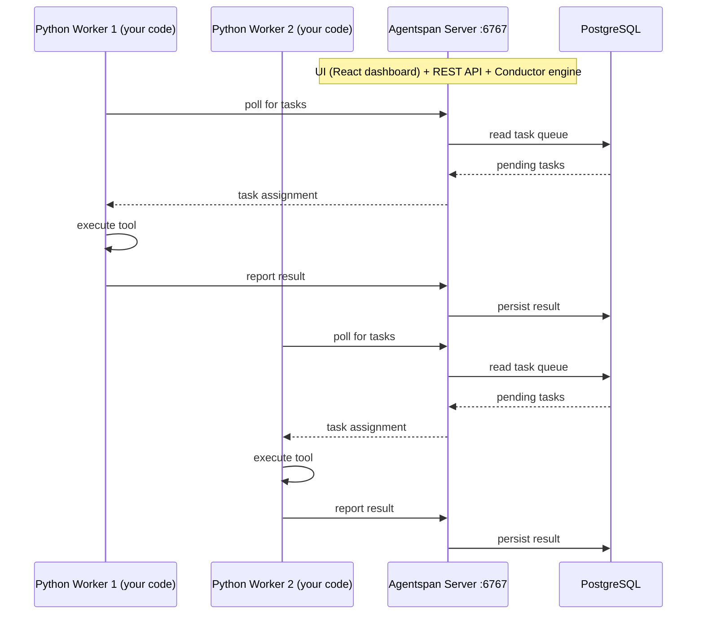

# Self-Hosting

Self-hosting Agentspan means running the Agentspan server on your own infrastructure. The server is a Spring Boot application backed by PostgreSQL. Workers are stateless Python processes that connect to it.

## Architecture



Workers poll the server for tasks to execute. Add more workers to scale throughput. Workers are completely stateless.

## Single VM — Docker Compose

The fastest way to self-host. Uses the compose stack from the repo:

```bash
git clone https://github.com/agentspan-ai/agentspan.git
cd agentspan/deployment/docker-compose
cp .env.example .env
```

Edit `.env` to set your LLM provider API keys (e.g. `OPENAI_API_KEY=sk-...`), then:

```bash
docker compose up -d
```

This starts:
- **agentspan** — the server, accessible at `http://localhost:6767`
- **postgres** — PostgreSQL 16

Verify:

```bash
curl http://localhost:6767/actuator/health
docker compose logs --tail=50 agentspan
```

Stop and clean up:

```bash
docker compose down        # stops containers, keeps data
docker compose down -v     # stops containers, removes postgres volume
```

## Running Workers

Workers are Python processes that connect to the server. Run them on the same host or on separate machines:

```bash
export AGENTSPAN_SERVER_URL=http://your-server:6767
export OPENAI_API_KEY=sk-...
python my_agent.py
```

Your agent code uses `AgentRuntime` as usual:

```python
from conductor.ai.agents import Agent, AgentRuntime, tool

@tool
def process_data(input: str) -> str:
    """Process some data."""
    return f"Processed: {input}"

agent = Agent(name="processor", model="openai/gpt-4o", tools=[process_data])

with AgentRuntime() as runtime:
    result = runtime.run(agent, "Process this dataset")
    result.print_result()
```

Run multiple worker processes in parallel to increase tool execution throughput.

## Authentication

For any server that isn't running on localhost, enable auth:

```bash
# In server .env file:
AGENTSPAN_AUTH_KEY=your-app-key
AGENTSPAN_AUTH_SECRET=your-app-secret

# In worker environment:
export AGENTSPAN_SERVER_URL=https://your-server.example.com
export AGENTSPAN_AUTH_KEY=your-app-key
export AGENTSPAN_AUTH_SECRET=your-app-secret
```

Or configure in code:

```python
from conductor.ai.agents import configure

configure(
    server_url="https://your-server.example.com",
    auth_key="your-app-key",
    auth_secret="your-app-secret",
)
```

## Multi-Node / Kubernetes

For multi-node deployments, use the Kubernetes manifests or Helm chart from `deployment/k8s/` and `deployment/helm/` in the repo.

Key points:
- Run multiple server replicas for high availability
- Use a managed PostgreSQL (RDS, Cloud SQL, etc.) not a containerized one
- Workers scale independently from the server — add as many as needed
- All server replicas share the same database

See [Deployment](/developer-guides/agentspan/reference/deployment) for Kubernetes YAML examples.

## Configuration Reference

The server is configured via environment variables:

| Variable | Default | Description |
|---|---|---|
| `SERVER_PORT` | `6767` | Port the server listens on |
| `SPRING_PROFILES_ACTIVE` | `default` (SQLite) | Set to `postgres` for PostgreSQL |
| `SPRING_DATASOURCE_URL` | `jdbc:sqlite:agent-runtime.db` | JDBC database URL |
| `SPRING_DATASOURCE_USERNAME` | `postgres` | Database user |
| `SPRING_DATASOURCE_PASSWORD` | `postgres` | Database password |
| `SPRING_DATASOURCE_HIKARI_MAXIMUM_POOL_SIZE` | `8` | Connection pool size |
| `AGENTSPAN_AUTH_KEY` | — | Application auth key |
| `AGENTSPAN_AUTH_SECRET` | — | Application auth secret |
| `OPENAI_API_KEY` | — | OpenAI API key |
| `ANTHROPIC_API_KEY` | — | Anthropic API key |
| `GEMINI_API_KEY` | — | Google Gemini API key |

All LLM provider keys follow the same pattern — set the key, the server auto-enables that provider.

## Backup and Recovery

Agentspan stores all execution state in PostgreSQL. Back up regularly using standard PostgreSQL tools:

```bash
pg_dump agentspan > backup.sql
```

Execution state is durable — in-progress executions resume after a server restart as long as the database is intact.
