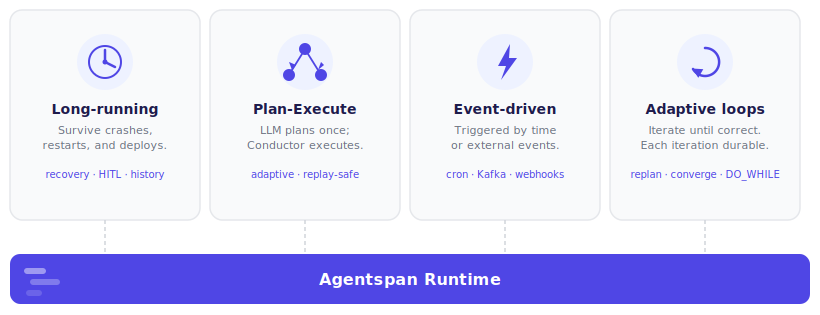

# Why Agentspan

**Agentspan is a durable runtime for AI agents, built for Conductor. Your code runs in your process. Execution state lives on the server — so crashes, restarts, and deployments don't lose work.**



---

## How most agent frameworks work (_and what could go wrong?_)

Most agent frameworks — LangGraph, the OpenAI Agents SDK, Google ADK, and others — run the agent loop inside your process. Your code calls the LLM, receives a tool call, executes the tool, and loops. All of that happens in memory, in your process.

```
Your process
└── agent loop
    ├── call LLM
    ├── execute tool
    ├── call LLM again
    └── ...until done
```
This works fine on your laptop. In production, it breaks in predictable ways.

### What can go wrong

**Process crash mid-run.** A long-running agent — one that searches the web, reads files, calls APIs across dozens of steps — can take minutes. If your process dies (OOM kill, deploy, network drop), the entire run is gone. There is no way to resume from where it stopped.

**Human-in-the-loop doesn't survive restarts.** Pausing an agent to wait for a human approval means holding state in memory. If anything interrupts that wait — a timeout, a restart, a deploy — the approval request is lost and the agent can't resume.

**No history, no replay.** In-process execution leaves no record. You can't see what an agent did on a past run, replay a run with a different model, or query execution history across agents.

**Scaling means duplicating state.** Running agents across multiple machines means solving distributed state management yourself — or accepting that each agent instance is isolated with no shared execution context.

**No scheduling without external infrastructure.** Running an agent on a cron means maintaining a separate scheduler, handling missed fires, and managing overlap. Any of those can fail silently — and there's no execution history tied to your agent when it does.

**Background jobs block or disappear.** Firing an agent asynchronously in-process — via threading or asyncio — means the job dies when your process does. There's no durable handle, no execution record, and no way to push new events into it from another process.

---

## How Agentspan separates orchestration from execution

Agentspan separates where your code runs from where execution state lives.

```
Your process                    Agentspan server
└── worker                      └── agent execution
    ├── registers tools             ├── tracks current step
    └── executes tool calls ←──────── delegates tool work
                                    ├── retries on failure
                                    ├── holds HITL state
                                    └── stores full history
```

Your agent definition compiles into a durable workflow on the Agentspan server. The server orchestrates execution — calling your worker to run tools, tracking state at every step, and resuming from the last completed step if anything goes wrong.

Your process can crash, restart, or be replaced. The agent keeps running.

---

## What this enables

### Long-running agents

**Crash recovery.** If your worker process dies mid-run, the server resumes execution when a new worker connects. No work is re-run from scratch — it picks up at the current step.

**Durable human-in-the-loop.** Mark any tool with `approval_required=True`. The agent pauses server-side and waits indefinitely — no timeouts, no in-memory state at risk. Approve or deny via CLI, API, or the UI.

**Full execution history.** Every run is stored with inputs, outputs, token usage, and per-step timing. Query via CLI, browse in the UI at `http://localhost:6767`, or replay any past run.

### Dynamic agents (Plan-Execute)

**LLM plans, Conductor executes.** Define a planner agent that emits a JSON DAG of operations at runtime — adapting the plan to the specific task and inputs. The server compiles it into an immutable Conductor sub-workflow: no LLM involved in orchestration, retries, parallelism, or validation. The plan is fixed once compiled — replay-safe and branch-stable. See [Plan-Execute](concepts/plan-execute.md).

**Call existing Conductor workflows.** Plan steps can invoke any deployed Conductor workflow as a sub-workflow. This bridges dynamic AI planning with your existing deterministic business automation — the LLM decides when to call it; Conductor handles the execution.

### Event-driven agents

**Scheduled agents.** Attach one or more crons to any agent at deploy time. The server fires the agent on cadence, tracks every execution, and lets you pause, resume, or trigger ad-hoc — without touching application code. See [Scheduling](scheduling.md).

**Conductor event handlers.** Agentspan runs on Conductor, which has native integrations for Kafka, SQS, AMQP, webhooks, and database events. Any event source that can trigger a Conductor workflow can trigger an agent — with a full durable execution record for every event.

### Adaptive loops

**Durable iterations.** Any framework can write a `while` loop. In Agentspan, each iteration is a Conductor workflow execution — crash mid-loop and the current iteration resumes when a worker reconnects. The loop itself survives process failures.

**Single execution ID across all iterations.** Using DO_WHILE inside a Conductor workflow, every iteration appears as a suffixed task (`planner_llm__1`, `planner_llm__2`, ...) under one workflow ID. The entire loop is observable, queryable, and replayable as a unit in the UI.

**Deterministic inner × adaptive outer.** Combine Plan-Execute (deterministic per-iteration execution) with an outer loop that adapts based on verified results. The LLM decides *what* to try next; Conductor handles *how* each attempt runs — with full parallelism, retry, and validation built in.

See [Adaptive Loops](concepts/adaptive-loops.md).

### Framework compatibility

**Works with frameworks you already use.** Pass a LangGraph `StateGraph`, an OpenAI Agents SDK `Agent`, or a Google ADK pipeline directly to `runtime.run()`. Your definitions stay unchanged.

---

## Frequently asked questions

**What makes Agentspan different from LangGraph?**
LangGraph is a graph framework for defining agent routing logic — nodes, edges, conditional branching. Agentspan is an execution runtime. You can pass a compiled LangGraph app directly to `runtime.run()` and it gains crash recovery, HITL, and execution history without changing a single node. They work together.

**What makes Agentspan different from the OpenAI Agents SDK?**
The OpenAI Agents SDK defines agents, handoffs, and tools. Its execution model is in-process. Agentspan wraps that execution so it runs server-side — your agent definitions, handoffs, and tools stay exactly as written.

**When should I use Agentspan?**
Whenever agents need to run reliably in production: long-running tasks, human approval steps, jobs that must survive process restarts, or situations where you need a queryable history of what every agent did.

**Does Agentspan replace my existing framework?**
No. If you use LangGraph, the OpenAI Agents SDK, or Google ADK, pass your existing agent directly to `runtime.run()`. If you write agents natively, use the `Agent` class — one Python object with tools, instructions, and strategy.

**What model providers does Agentspan support?**
Any provider with an OpenAI-compatible API. Set the model with one string: `"openai/gpt-4o"`, `"anthropic/claude-sonnet-4-6"`, `"google_gemini/gemini-2.0-flash"`. See [LLM Providers](/developer-guides/agentspan/reference/providers) for the full list.
