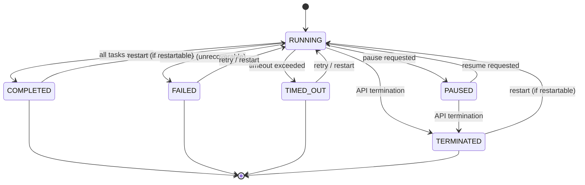

# Workflows

A workflow is a sequence of tasks with a defined order and execution. Each workflow encapsulates a specific process, such as:

- Classifying documents
- Ordering from a self-checkout service
- Upgrading cloud infrastructure
- Transcoding videos
- Approving expenses

In Conductor, workflows can be defined and then executed. Learn more about the two distinct but related concepts, **workflow definition** and **workflow execution**, below.


## What makes Conductor workflows different

Conductor workflows stand apart from traditional orchestration approaches in several key ways:

- **Durable execution** — Workflows survive process failures, restarts, and infrastructure outages. Conductor persists state at every step, so a long-running workflow or async workflow picks up exactly where it left off — even after days or weeks.
- **JSON-native definitions** — Every workflow is a JSON workflow definition you can store in version control, diff across releases, and generate programmatically. No compiled DSL or proprietary format required.
- **Dynamic workflows** — Workflows can be created and modified at runtime as code-first or JSON definitions, enabling use cases where the task graph is not known ahead of time (for example, when the number of parallel branches depends on an API response).
- **Versioned** — Each workflow definition carries an explicit version number so you can roll out changes incrementally and run multiple versions side by side.
- **Language-agnostic** — Workers that execute tasks can be written in any language — Java, Python, Go, JavaScript, C#, Ruby, or Rust — and deployed anywhere. The workflow definition itself is decoupled from implementation.


## Workflow definition

The workflow definition describes the flow and behavior of your business logic. Think of it as a blueprint specifying how it should execute at runtime until it reaches a terminal state. The workflow definition includes:

- The workflow's input/output keys.
- A collection of [task configurations](/content/quickstarts/tasks#task-configuration) that specify the task conditions, sequence, and data flow until the workflow is completed.
- The workflow's runtime behavior, such as the timeout policy and compensation flow.


### Example JSON workflow definition

Below is a realistic three-task workflow that fetches data from an API, transforms it with an inline script, and then delegates the result to a worker task for further processing.

```json
{
  "name": "process_order",
  "description": "Fetch order details, enrich them, and hand off to fulfillment",
  "version": 1,
  "schemaVersion": 2,
  "ownerEmail": "team-platform@example.com",
  "timeoutPolicy": "ALERT_ONLY",
  "timeoutSeconds": 3600,
  "restartable": true,
  "failureWorkflow": "handle_order_failure",
  "inputParameters": ["orderId"],
  "outputParameters": {
    "enrichedOrder": "${enrich_order.output.result}",
    "fulfillmentStatus": "${fulfill_order.output.status}"
  },
  "tasks": [
    {
      "name": "fetch_order",
      "taskReferenceName": "fetch_order",
      "type": "HTTP",
      "inputParameters": {
        "http_request": {
          "uri": "https://api.example.com/orders/${workflow.input.orderId}",
          "method": "GET",
          "connectionTimeOut": 5000,
          "readTimeOut": 5000
        }
      }
    },
    {
      "name": "enrich_order",
      "taskReferenceName": "enrich_order",
      "type": "INLINE",
      "inputParameters": {
        "order": "${fetch_order.output.response.body}",
        "evaluatorType": "graaljs",
        "expression": "(function() { var o = $.order; o.region = o.country === 'US' ? 'domestic' : 'international'; return o; })()"
      }
    },
    {
      "name": "fulfill_order",
      "taskReferenceName": "fulfill_order",
      "type": "SIMPLE",
      "inputParameters": {
        "enrichedOrder": "${enrich_order.output.result}"
      }
    }
  ]
}
```


### Workflow definition parameters

| Parameter | Type | Description |
|---|---|---|
| **name** | `string` | A unique name identifying the workflow. Used when starting executions. |
| **version** | `integer` | The version of the workflow definition. Allows multiple versions to coexist. |
| **tasks** | `array[object]` | An ordered list of [task configurations](/content/quickstarts/tasks#task-configuration) that define the workflow's execution graph. |
| **inputParameters** | `array[string]` | List of input keys the workflow expects when triggered. |
| **outputParameters** | `object` | Mapping of output keys to expressions that extract values from task outputs. |
| **failureWorkflow** | `string` | Name of a workflow to trigger when this workflow transitions to FAILED. Useful for compensation or alerting. |
| **timeoutPolicy** | `string` | Policy to apply when the workflow exceeds `timeoutSeconds`. Supported values: `TIME_OUT_WF` (fail the workflow) or `ALERT_ONLY` (mark timed out but keep running). |
| **timeoutSeconds** | `integer` | Maximum time (in seconds) the workflow is allowed to run before the timeout policy is applied. Set to `0` for no timeout. |
| **restartable** | `boolean` | Whether the workflow can be restarted after completion or failure. Defaults to `true`. |
| **ownerEmail** | `string` | Email address of the workflow owner. Used for notifications and audit tracking. |
| **schemaVersion** | `integer` | Schema version of the workflow definition format. Current version is `2`. |


## Workflow execution

A workflow execution is the execution instance of a workflow definition.

Whenever a workflow definition is invoked with a given input, a new workflow execution with a unique ID is created. The workflow is governed by a defined state (like RUNNING or COMPLETED), which makes it intuitive to track the workflow.


### Workflow execution states

Each workflow execution transitions through a set of well-defined states:

| State | Description |
|---|---|
| **RUNNING** | The workflow is actively executing tasks. |
| **COMPLETED** | Terminal status where all tasks in the workflow have completed successfully. |
| **FAILED** | Terminal status where one or more tasks failed and the workflow could not recover. If a [`failureWorkflow`](/content/error-handling#workflow-compensation-flows) is configured, it will be triggered. You can [retry the workflow execution from the failed task](/content/developer-guides/debugging-workflows#recovering-from-failures). |
| **TIMED_OUT** | Terminal status where the workflow's configured `timeoutSeconds` has elapsed, or a task with `timeoutPolicy: TIME_OUT_WF` has timed out. |
| **TERMINATED** | Terminal status where an incomplete workflow was explicitly stopped by a user, event, or another workflow. |
| **PAUSED** | The workflow is paused by a user or an external event and is awaiting a manual action to resume. |

The following diagram illustrates how a workflow transitions between states:




## Next steps

- [Tasks](/content/quickstarts/tasks) — Learn about the building blocks that make up a workflow, including system tasks, worker tasks, and operators.
- [Workers](/content/quickstarts/workers) — Understand how to implement task workers in any programming language.
- [Handling errors](/content/error-handling) — Configure retries, failure workflows, and compensation strategies.
