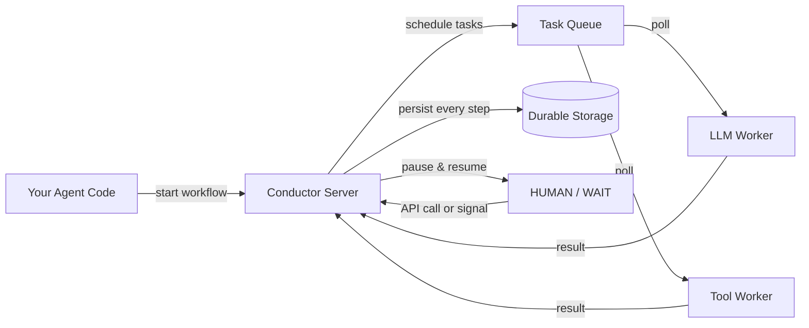

# AI Cookbook

Orkes Conductor is not an AI framework. It is a durable execution engine that provides AI agent orchestration and LLM orchestration by solving the hard infrastructure problems that AI agents create: long-running processes, unreliable external calls, tool use, human-in-the-loop approval, structured output, and the need to survive failures across any of these steps. Orkes Conductor lets you run agents as durable workflows that can survive crashes, retries, and infrastructure failures without losing completed progress.

## Where Conductor fits

Use your agent framework for reasoning, prompts, graph composition, and model-specific loops. Use Conductor for execution: persisted state, task queues, retries, timeouts, durable human waits, replay, governance, and audit history.

Agentspan is the developer-facing agent runtime. Conductor OSS is the durable workflow engine underneath. Orkes Conductor is the managed enterprise platform for operating Conductor-based systems at scale.

Conductor is the durable runtime under production agents and distributed workflows. It is not a replacement for every agent framework, and it should not be positioned as one. Keep the framework where it helps the model reason; add Conductor where the work must finish reliably.

## The problem agents create

An AI agent is a long-running process that:

1. **Calls an LLM** to decide what to do next.
2. **Calls tools** (APIs, databases, other services) to take action.
3. **Waits** for external events, human approval, or time-based delays.
4. **Loops** through plan/act/observe cycles until a goal is reached.
5. **Returns structured output** to the caller or another system.

Each of these steps can fail, take minutes to hours, or require intervention. Running this in a single process means any crash loses all progress. Running it in a queue means building your own state machine, retry logic, and observability. Conductor provides all of this out of the box.

## How it works

Your agent code starts a workflow. Conductor schedules each step as a task, persists every input and output to durable storage, and manages retries, timeouts, and pauses. Workers (LLM calls, tool calls) poll for tasks, execute them, and return results. If any worker or the server itself crashes, execution resumes from the last completed step.

## How Conductor's primitives map to agent patterns

| Agent pattern | Conductor primitive | What happens mechanically |
|---|---|---|
| **LLM call** | `LLM_CHAT_COMPLETE` / `LLM_TEXT_COMPLETE` system task | Native LLM task. Configure provider and model as parameters. Retried on failure. Prompt, response, and token usage persisted. |
| **Embeddings** | `LLM_GENERATE_EMBEDDINGS` system task | Generate vector embeddings using any configured provider. Output stored and passed to downstream tasks. |
| **RAG / semantic search** | `LLM_INDEX_TEXT` + `LLM_SEARCH_INDEX` system tasks | Index documents and run semantic search against Pinecone, Weaviate, pgvector, or MongoDB Atlas. No external RAG framework needed. |
| **Wait for human approval** | `HUMAN` task | Workflow pauses. Remains `IN_PROGRESS` in persistent storage. Resumes when the Task Update API is called with approval/rejection. Survives deploys. |
| **Wait for external event** | `WAIT` task (time-based) or `HUMAN` task with event handler | Durable pause. Timer or signal resolution survives server restarts. |
| **Wait for webhook** | `WAIT_FOR_WEBHOOK` task | Workflow pauses until a matching external callback arrives, then resumes with the callback payload. Purpose-built for long-running external callbacks. |
| **Plan/act/observe loop** | `DO_WHILE` operator | Loop until a condition is met. Each iteration is a persisted step. The loop counter and state survive failures. |
| **Dynamic tool selection** | `DYNAMIC` task or `FORK_JOIN_DYNAMIC` | The LLM output determines which task(s) to run next. Conductor resolves the task type at runtime. |
| **Multi-agent / sub-agent** | `SUB_WORKFLOW` task | Spawn a child agent as a sub-workflow. Parent waits for completion. Failure in a child can trigger compensation in the parent. Full observability across the entire agent tree. |
| **Rollback on failure** | `failureWorkflow` + compensation pattern | When an agent fails after taking real-world actions, a failure workflow runs compensating tasks (undo API calls, send notifications, release resources). |
| **Structured output** | Workflow `outputParameters` | Map task outputs to a structured JSON response using Conductor's expression syntax. |
| **Expose as API** | Conductor REST API: `POST /api/workflow/{name}` | Any workflow is callable via HTTP. Start synchronously or asynchronously. Get structured output back. |
| **Expose as MCP tool** | MCP Gateway integration | Register any workflow as an MCP tool via the MCP Gateway. External agents and LLMs can discover and invoke it, receiving structured output. |

## What you'd have to build without Conductor

If you run agents only inside an in-process or non-durable runtime, you are responsible for:

- **State persistence** &mdash; Checkpointing agent progress so crashes don't restart from zero.
- **Retry logic** &mdash; Retrying failed LLM and tool calls with backoff, deduplication, and timeout handling.
- **Human-in-the-loop** &mdash; Building a pause/resume mechanism that survives process restarts and deploys.
- **Compensation** &mdash; Rolling back side effects (sent emails, created records, charged payments) when a downstream step fails.
- **Observability** &mdash; Logging every LLM prompt, response, tool call, and decision in a queryable, auditable format.
- **Multi-agent coordination** &mdash; Managing parent-child lifecycle, failure propagation, and shared state across sub-agents.
- **Scalability** &mdash; Distributing work across multiple worker processes and scaling them independently.

Conductor provides all of this as infrastructure. Your agent code focuses on the logic — what to ask the LLM, which tools to call, what to do with the results.

## Next steps

- **[Build Your First AI Agent](/content/ai-agents/first-ai-agent)** &mdash; Step-by-step: define a tool-calling agent with Agentspan, run it, and add human-in-the-loop approval. 5 minutes.
- **[AI & LLM Recipes](/content/ai-orchestration/ai-llm-recipes)** &mdash; Ready-to-use recipes: chat completion, RAG, web search, coding agents, and more.
- **[LLM Orchestration](/content/ai-orchestration/llm-orchestration)** &mdash; Native LLM providers and vector database workflows for RAG pipelines.
- **[Production Agent Architecture](/content/ai-agents/production-agent-architecture)** &mdash; The canonical reference architecture for a durable production agent. End-to-end pattern with every primitive mapped.
- **[Failure Semantics for AI Agents](/content/ai-agents/failure-semantics)** &mdash; The exact failure contract: what happens under crashes, retries, duplicates, long waits, and partial side effects.
- **[Why Conductor for Agents](/content/why-conductor-for-ai-agents)** &mdash; What Conductor gives you out of the box for agentic workflows.
- **[Durable Agents](/content/ai-agents/durable-agents)** &mdash; What persists, what gets retried, and why JSON is AI-native.
- **[Human-in-the-Loop](/content/ai-agents/human-in-the-loop)** &mdash; Pre-execution review, conditional approval, and LLM-as-judge patterns.
- **[Dynamic Workflows](/content/ai-agents/dynamic-workflows)** &mdash; Agent loops, dynamic workflow generation, and tool use examples.
- **[Token Efficiency](/content/ai-agents/token-efficiency)** &mdash; How durable execution saves tokens and reduces LLM costs.

## Learn more

## In this section

- [AI & LLM Recipes](/content/ai-orchestration/ai-llm-recipes)
- [LLM Orchestration](/content/ai-orchestration/llm-orchestration)
