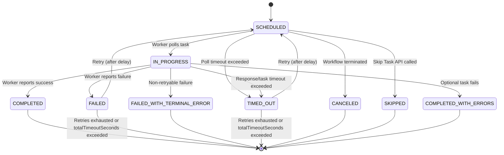

# Task Lifecycle

During a workflow execution, each task transitions through a series of states. Understanding these transitions is key to configuring retries, timeouts, and error handling correctly.

## State diagram

## Task statuses

| Status | Description | Retriable | Terminal |
| :--- | :--- | :--- | :--- |
| `SCHEDULED` | Task is queued and waiting for a worker to poll it. | Yes | No |
| `IN_PROGRESS` | A worker has picked up the task and is executing it. | Yes | No |
| `SKIPPED` | The task is skipped without executing, and the workflow continues to the subsequent tasks.    Occurs if the [Skip Task API](/content/reference-docs/api/workflow/skip-task-from-workflow) is used in a currently running workflow. | No | Yes |
| `TIMED_OUT` | The task timed out without being completed.    Occurs if the task has been configured with the following timeout parameters in its task definition: <ul><li>timeoutPolicy.</li><li>timeoutSeconds</li><li>pollTimeoutSeconds</li><li>responseTimeoutSeconds</li></ul> | Yes | Yes |
| `CANCELED` | A SCHEDULED or IN_PROGRESS task has been canceled without being completed because the workflow has been terminated. | No | Yes |
| `FAILED` | Task failed due to an error. Conductor will retry based on the task definition's retry configuration. | Yes | Yes |
| `FAILED_WITH_TERMINAL_ERROR` | Task failed with a non-retryable error. No retries will be attempted. | No | Yes |
| `COMPLETED_WITH_ERRORS` | The task has encountered errors but is still completed.    Occurs only when a task is set as optional in the workflow definition and fails during execution. The workflow will continue even when there are errors. | Yes | Yes |
| `COMPLETED` | Task completed successfully. | Yes | Yes |

## How task status affects workflow status

- A task reaching `FAILED` (after retries exhausted) or `FAILED_WITH_TERMINAL_ERROR` moves the workflow to `FAILED`, triggering its `failureWorkflow` if configured.
- A task reaching `TIMED_OUT` (after retries exhausted) moves the workflow to `TIMED_OUT` if the task's `timeoutPolicy` is `TIME_OUT_WF`.
- A task marked `COMPLETED_WITH_ERRORS` (optional task) does not affect workflow status — the workflow continues normally.

See [Workflow execution states](/content/quickstarts/workflows#workflow-execution-states) for the full workflow-level picture.

## Inspecting a task's status

When a task lands in `FAILED` or `TIMED_OUT`, its `reasonForIncompletion` field tells you why — a worker exception, timeout, validation failure, or terminal error reason. See [Inspecting a task execution](/content/developer-guides/debugging-workflows#inspecting-a-task-execution) for the full set of fields to check (`inputData`, `outputData`, `retryCount`, `workerId`, and more).

## Retry and timeout configuration

Retry and timeout behavior for a task is controlled by its task definition (`retryCount`, `retryLogic`, `backOffScaleFactor`, `timeoutSeconds`, `responseTimeoutSeconds`, `pollTimeoutSeconds`, `timeoutPolicy`). See [Handling Failures](/content/error-handling) for the full configuration reference and example scenarios.

## Related pages

- [Run Your First Workflow](/content/quickstarts)
- [Basic Concepts](/content/quickstarts/concepts)
- [Conductor Architecture and Worker Polling](/content/conductor-architecture)
- [Durable Execution Semantics](/content/quickstarts/durable-execution)
- [JSON + Code Native Workflow Orchestration](/content/quickstarts/json-code-native)
- [Workflow Concepts](/content/quickstarts/workflows)
